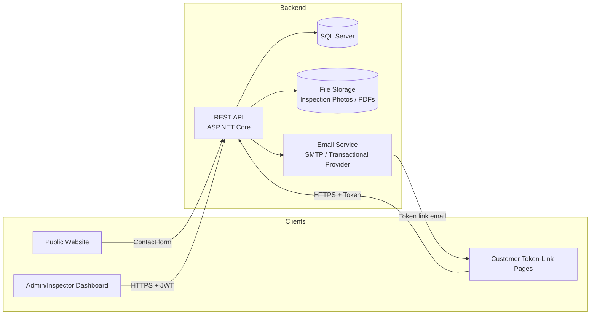

# Architecture Document

**Project:** RenoTrack — Renovation Company Website & Project-Tracking Dashboard
**Version:** 1.0
**Companion document:** SRS.md (functional requirements — read that first)

> This document is independent of, and unrelated to, any other project previously discussed (e.g. "RenoFlow"). It describes the technical architecture for this new system from scratch.

---

## 1. Goals & Principles

- **Ship a working v1, simply.** Favor a straightforward, well-structured monolith over premature microservices/multi-service complexity.
- **One backend, two front-ends.** A single source of truth (API + database) serves both the public Website and the internal Dashboard.
- **No customer accounts in v1.** Customer-facing interactions happen through secure, single-purpose token links — this shapes several architectural decisions below (§7).
- **Design for the one forward-looking requirement the Product Owner asked for:** the Invoice/Payment model must not need breaking changes when a real payment gateway is added later (SRS FR-8.5).
- **Keep it a real, portfolio-worthy codebase:** clean layering, consistent conventions, and a structure a reviewer can understand quickly.

---

## 2. High-Level Architecture



- **Public Website** — server-rendered pages (fast, SEO-friendly, no login). Submits the contact form to the API.
- **Dashboard** — a single-page application used by Admin and Inspector, authenticated with JWT.
- **Token-Link Pages** — a small set of public, unauthenticated pages (view Angebot, view Invoice, Approve/Reject) resolved by a token, not a login session. These can be served by the same Website project as simple routes, since they require no dashboard chrome.
- **API** — the single backend, owning all business logic and data access.
- **Database** — one relational database (SQL Server), one schema.
- **File Storage** — inspection photos and generated PDFs; local disk under a structured path for v1, with an abstraction that allows swapping to cloud blob storage later without touching business logic.
- **Email Service** — sends token links and internal notifications.

---

## 3. Solution Structure (Clean Architecture)

```
RenoTrack.sln
│
├── src/
│   ├── RenoTrack.Domain/            # Entities, enums, value objects, domain rules — no dependencies
│   ├── RenoTrack.Application/       # Use cases: Commands/Queries (CQRS-lite), DTOs, validators, interfaces
│   ├── RenoTrack.Infrastructure/    # EF Core, repositories, email sender, file storage, token-link service
│   ├── RenoTrack.Api/               # ASP.NET Core Web API — controllers/endpoints, auth, DI wiring
│   ├── RenoTrack.Dashboard/         # SPA front-end (Admin/Inspector)
│   └── RenoTrack.Website/           # Public site + token-link pages (server-rendered)
│
└── tests/
    ├── RenoTrack.Domain.Tests/          # References Domain only — proves it is testable in total isolation
    ├── RenoTrack.Application.Tests/
    ├── RenoTrack.Infrastructure.Tests/  # Added Phase 3 — real LocalDB integration tests, not in-memory fakes
    └── RenoTrack.Api.Tests/
```

`RenoTrack.Domain.Tests` is a project on its own, separate from `Application.Tests`, specifically so the dependency rule below is enforced by the build for tests too, not just production code: it references `RenoTrack.Domain` and nothing else, so it is structurally impossible for a "Domain test" to accidentally depend on Application-layer concerns (handlers, DTOs, validators). `RenoTrack.Infrastructure.Tests` was added as a deliberate Phase 3 addition (not part of the original Phase 0 structure above) specifically because neither `Domain.Tests`/`Application.Tests` (which test in isolation from any database) nor `Api.Tests` (which references only `RenoTrack.Api`, and Phase 4 hasn't built any endpoints yet) can exercise real EF Core/repository behavior — decimal precision, unique constraints, FK enforcement, backing-field collection navigation — the things Phase 3 specifically needs to verify.

**Dependency rule:** Domain has no dependencies. Application depends only on Domain. Infrastructure and API depend on Application (and, for wiring, on each other via DI at the composition root). Front-ends (Dashboard, Website) talk to the API only over HTTP — they never reference backend projects directly.

This mirrors standard Clean Architecture and keeps business rules (Angebot totals, VAT breakdown, workflow transitions) testable in the Application layer, independent of the database or web framework.

---

## 4. Technology Stack

| Layer | Choice | Rationale |
|---|---|---|
| Backend API | ASP.NET Core (Web API) | Strong typing, mature ecosystem, good fit for a structured business workflow like this |
| Dashboard | Angular (SPA) | Suited to a data-heavy, form-heavy internal tool with role-based views |
| Public Website | ASP.NET Core Razor Pages | Server-rendered, fast, SEO-friendly, simple content maintenance — no SPA overhead needed for a marketing site |
| Database | SQL Server + EF Core | Relational integrity fits invoicing/quoting data well; EF Core migrations give a clean audit trail of schema changes |
| Authentication | ASP.NET Core Identity (Admin/Inspector) + JWT bearer tokens for the Dashboard/API | Standard, well-understood, easy to reason about for two internal roles |
| Customer access | Custom Token-Link mechanism (not a full auth system) | Matches the "no customer accounts in v1" decision; simpler and more appropriate than issuing real accounts for one-time decisions |
| Email | SMTP or a transactional provider (e.g. SendGrid) behind an `IEmailSender` interface | Swappable without touching business logic |
| File Storage | Local disk (v1) behind an `IFileStorage` interface | Swappable for Azure Blob/S3 later with zero change to calling code |
| PDF Generation | Server-side HTML→PDF (e.g. a .NET PDF library) for Angebot/Invoice documents | Needed for email attachments and downloads |

---

## 5. API Design

### 5.1 Conventions
- RESTful resource-oriented routes, versioned from day one: `/api/v1/...`
- Standard HTTP verbs/status codes; errors returned as **RFC 7807 ProblemDetails** for consistency across the API.
- Pagination on list endpoints (`?page=`, `?pageSize=`), filtering by status/date/assignee where relevant (per SRS FR-2.4).
- CQRS-lite in the Application layer: one Command or Query class per use case, handled by a single handler — keeps each business operation isolated and testable (this is the same pattern used successfully on the previous project, and is proven to keep controllers thin).

### 5.2 API Endpoint Inventory

> **Authoritative and exhaustive.** Every endpoint the API exposes has a row here, and a row is
> added in the same commit that adds the endpoint. *(Retitled during the Phase 8 completion sweep:
> this section read "Representative Endpoints" while every slice from Phase 4 onward treated it as
> the inventory and logged missing rows as defects. The heading now matches the practice, and the
> table was reconciled against all 8 controllers and their 38 actions — the three rows that were
> missing are marked below.)* A row may cover sibling routes that share a contract; it may never
> omit one.

| Resource | Endpoint | Notes |
|---|---|---|
| Auth | `POST /api/v1/auth/login` | Anonymous. Email + password → access token + refresh token (SRS FR-10.1). **Row added in the Phase 8 completion sweep** — built in Phase 4 Slice 4 and never listed here. Every failure mode returns an identical 401 so login cannot become an account-enumeration oracle; FR-10.3's lockout is wired explicitly (D60). Deliberately outside the CQRS pipeline — no Application command exists or should |
| Auth | `POST /api/v1/auth/refresh` | Anonymous. Exchanges a refresh token for a new pair. **Row added in the Phase 8 completion sweep.** Tokens are persisted as SHA-256 hashes only, rotated on every use, and presenting an already-revoked token revokes the whole chain for that user (D60) |
| Leads | `POST /api/v1/leads` | Public — used by the website contact form |
| Leads | `GET /api/v1/leads`, `GET /api/v1/leads/{id}` | Dashboard, Admin/Inspector (scoped) |
| Inspections | `POST /api/v1/leads/{leadId}/inspections` | Admin schedules |
| Inspections | `PATCH /api/v1/inspections/{id}` | Inspector records/revises notes (SRS FR-3.3) |
| Inspections | `POST /api/v1/inspections/{id}/photos` | Inspector uploads |
| Inspections | `POST /api/v1/inspections/{id}/complete` | Inspector |
| Angebote | `POST /api/v1/leads/{leadId}/angebote` | Inspector drafts |
| Angebote | `POST /api/v1/angebote/{id}/sections`, `.../items` | Inspector builds line items; `items` accepts an optional `catalogItemId` to pre-fill from Catalog (SRS FR-4.9) |
| Angebote | `DELETE /api/v1/angebote/{id}/sections/{sectionId}`, `.../items/{itemId}` | Inspector removes line items while the Angebot is editable — `PermissionMatrix.md` §3's "Add/**remove** Sections & Items". Returns the refreshed totals; refused with 409 once the Angebot leaves `Draft`/`ChangesRequested` |
| Angebote | `GET /api/v1/angebote/{id}` | The full tree — header, sections, items, VAT breakdown. Admin `F`, Inspector `S`. **Added in Phase 5**: internal review is impossible without a read, and this table previously listed only writes |
| Angebote | `GET /api/v1/leads/{leadId}/angebote` | That Lead's Angebote, newest first. Admin `F`; an Inspector sees only their own (scoped by `WHERE`, not after loading). Unpaged — StateMachine §2.4 bounds this list |
| Catalog | `GET /api/v1/catalog-items`, `POST /api/v1/catalog-items` | Admin manages; Inspector reads for selection while building an Angebot. `GET` takes `?searchTerm=` (Wireframe D2's "Search Catalog" box) plus `?page=`/`?pageSize=` per §5.1; retired items never appear and there is no flag to include them (BR-12, D37) |
| Catalog | `PUT /api/v1/catalog-items/{id}`, `POST /api/v1/catalog-items/{id}/retire` | Admin only (`PermissionMatrix.md` §6). **Retire, not `DELETE`** — BR-12 keeps the row so trace links stay valid (BR-8) and it remains a usable direct reference (BR-14); retirement affects discovery only |
| Catalog | `POST /api/v1/angebot-items/{id}/save-as-catalog-item` | Inspector, one-click (SRS FR-4.10) |
| Angebote | `POST /api/v1/angebote/{id}/duplicate` | Inspector duplicates a whole Angebot onto another Lead (SRS FR-4.11). Source restricted to their own; target Lead ownership and the one-active-Angebot rule both apply. Section-level duplication is deferred until a real caller needs it |
| Angebote | `POST /api/v1/angebote/{id}/submit-for-review` | Inspector → Admin |
| Angebote | `POST /api/v1/angebote/{id}/approve`, `/request-changes`, `/send` | Admin |
| Angebote | `GET /api/v1/angebote/{id}/review-comments` | The internal review history, oldest first. Admin `F`, Inspector `R` (`PermissionMatrix.md` §4 "View review comment history" — both roles read, only Admin writes). **Row added in the Phase 8 completion sweep** — built in Phase 5 Slice 2 and never listed here |
| Angebot decision (public) | `GET /api/v1/public/angebote/{token}` | Token-link view, no auth. **Built in Phase 6.** Returns a dedicated public DTO — never the internal `AngebotDetailDto` — carrying only what Wireframe A3 renders; internal ids, staff ids, `CatalogItemId` and timestamps are deliberately absent. Readable **after** a decision (BR-4). 404 for unknown *or* non-Angebot tokens, indistinguishably; 410 for expiry |
| Angebot decision (public) | `POST /api/v1/public/angebote/{token}/decision` | Lead approves/rejects. **Built in Phase 6.** Body is `{ decision }` only — **no rejection reason**, a deliberate documented gap against FR-6.3 pending its own ADR. Consumes the link, records the Angebot decision and moves the Lead to `Won`/`Lost` in one transaction (StateMachine §5). 409 if the link has already decided |
| Projects | `POST /api/v1/angebote/{id}/convert-to-project` | Admin. **Built in Phase 7.** BR-2's guard (only a `CustomerApproved` Angebot converts) and "already converted" both surface as 409. No request body — the Angebot id comes from the route and the Admin from the token (D61). Returns 201 with a `Location` pointing at the row below |
| Projects | `GET /api/v1/projects/{id}` | Admin `F`, Inspector `R` (`PermissionMatrix.md` §5 — read-only but **unscoped**, so no ownership check). **Added in Phase 7**; this row was missing from earlier drafts of this table even though §5 granted the permission, the same gap `GET /api/v1/inspections/{id}` still has. **Serves SRS FR-7.4 in full as of Phase 8 Slice 6**, which added `alreadyInvoiced`, `remaining` and the Project's `invoices` list (id, number, gross, status, due date — Wireframe E1's columns). The two figures follow the same rule as the balance row below: `Void` excluded and nothing else, never clamped. **Voided Invoices remain in the list** (BR-9) and are absent from the arithmetic only. The whole response, invoice list included, is Inspector-readable and confers no Invoice-management permission |
| Projects | `POST /api/v1/projects/{id}/complete` | Admin (`PermissionMatrix.md` §5 "Mark Project Completed (incl. override)"). **Built in Phase 8 Slice 6**; this row was missing even though §5 granted the action, StateMachine §4.3 defined the transition and Sequence §10 named the route. Body `{ forceOverride, reason }` is **optional** — omitting it means no override; the Admin comes from the token and the Project from the route (D61). **409** when the Project's Invoices block it (none at all, or one or more `Draft`/`Sent`/`Overdue`) and no override was given, and separately when the Project is not `Active` — `Project.Complete()` refuses that on its own and **no override reaches it**. Preconditions are evaluated before the aggregate is touched, so for a non-`Active` Project an invoice-derived refusal is reported first; every combination still refuses and none completes the Project (D67). **400** for `forceOverride` without a reason (FR-8.6), a reason without `forceOverride` (rejected, never silently dropped), and `forceOverride` when nothing is blocking. Returns 200 with `ProjectDto`. Audited as `ProjectCompleted` against the Project, the reason in `details` on the override path — **the reason's only storage**, since `ERD.md` defines no column for it |
| Projects | `GET /api/v1/projects/{id}/invoice-balance` | Admin `F`, Inspector `R` (`PermissionMatrix.md` §5's financial-summary row — read-only and **unscoped**, so no ownership check). **Added in Phase 8 Slice 3**; this row was missing even though Sequence Diagram §8 names the route and BR-3 assigns the warning to it. Returns `{ projectId, agreedTotal, alreadyInvoiced, remaining }`. `alreadyInvoiced` excludes `Void` invoices (StateMachine §3.3) and nothing else. **`remaining` may be negative — that is BR-3's warning, never a rejection and never clamped** |
| Invoices | `POST /api/v1/projects/{id}/invoices` | Admin. **Built in Phase 8 Slice 3.** Body is `{ grossAmount, dueDate }` only — the invoice number is reserved server-side (§8) and the Admin comes from the token (D61). The entered gross is split across the originating Angebot's VAT rates (FR-8.2). **Exceeding the agreed total is accepted** (BR-3 warns, never blocks). 409 for a `Completed` Project (StateMachine §5) and for a positive amount against an Angebot whose gross total is zero, where no VAT split can be derived. Returns 201 with **no `Location`** — no invoice read endpoint is documented |
| Invoices | `POST /api/v1/invoices/{id}/send` | Admin. **Built in Phase 8 Slice 4.** No request body — the Invoice id comes from the route and the Admin from the token (D61); the token and its expiry are generated server-side. Moves `Draft → Sent`, issues a single-use-shaped `TokenLink` and emails the customer, all in one `SaveChangesAsync`. 409 if the Invoice is not `Draft` or its gross is zero (StateMachine §3.3). **No PDF is generated or attached** — Phase 14 owns that (G-4), and FR-8.3 is satisfied by the link |
| Invoices | `POST /api/v1/invoices/{id}/mark-paid` | Admin. **Built in Phase 8 Slice 5.** Body is `{ paidAt, method }` — **no amount**: Phase 8 records full payment only, so the `Payment` child always carries the Invoice's own gross (FR-8.4, Sequence §9, Wireframe E3 all offer none). The recording Admin comes from the token (D61). `Sent`/`Overdue` → `Paid`; 409 otherwise, which is also what makes a duplicate confirmation impossible since `Paid` is terminal. Does **not** move the invoice balance — a `Sent` invoice already counted |
| Invoices | `POST /api/v1/invoices/{id}/void` | Admin. **Built in Phase 8 Slice 5**; this row was missing from earlier drafts of this table even though `PermissionMatrix.md` §5 granted the action. Body is `{ reason }`, **required from every source state including `Draft`** (§5 unqualified; StateMachine §3.3 reconciled in Slice 1). `Draft`/`Sent`/`Overdue` → `Void`; 409 from `Paid`/`Void`. BR-9: the row and its number survive — this is a status change, never a delete. The invoice leaves the remaining-balance math immediately (§3.3), and its token link stays readable, now reporting `Void` |
| Invoice (public) | `GET /api/v1/public/invoices/{token}` | Token-link view, no auth. **Built in Phase 8 Slice 4.** Returns a dedicated public DTO — never `InvoiceDto` — carrying only what Wireframe A4 renders: number, customer name, net/VAT/gross and due date. Internal ids, issue date, void reason and payments are deliberately absent. **A dedicated `status` (`Open`/`Paid`/`Void`) was added in Slice 5** — never the internal `InvoiceStatus`; `Draft`/`Sent`/`Overdue` all collapse to `Open`. `Paid` and `Void` do **not** invalidate the link. **`UsedAt` is not checked**: PermissionMatrix §7 grants viewing only, so no Invoice decision action exists and an Invoice link is never consumed. 404 for unknown *or* non-Invoice tokens, indistinguishably; 410 for expiry. **Bank details and a PDF download are absent** though A4 shows both (G-5, G-4), and A4's "VAT (19%)" label carries no percentage — an Invoice stores a VAT amount and no rate, since `InvoiceLine` is deferred |

**There is deliberately no endpoint for editing a Lead's status directly.** An earlier draft of this table listed `PATCH /api/v1/leads/{id}/status` (Admin); it was removed as obsolete rather than implemented, because three other documents already say a free-standing status edit does not exist. `BusinessRules.md` BR-7: a Lead's status *"can only move forward through the defined pipeline via explicit, named actions — never silently or as a side effect."* `PermissionMatrix.md` §1: *"neither role edits status directly except via the defined transitions."* `StateMachine.md` §1.3 gives every transition a named event with its own guard. Lead status therefore changes only as a consequence of the action that causes it — `ScheduleInspection`, `CompleteInspection`, `CreateAngebot`, `SendAngebot`, and the customer's own Angebot decision.

**`Won` and `Lost` specifically are outcomes of the customer's token-link decision, not staff actions.** `StateMachine.md` §1.3 guards both on *"TokenLink valid & unused"*; §5 states the invariant that *"Lead.Status is only set to `Won` inside the same transaction as the Angebot decision handler"*; SRS FR-6.3/FR-6.5 assign the decision to the Lead and require it to update status immediately; and Sequence Diagram §6 routes it through `POST /api/v1/public/angebote/{token}/decision` → `RecordAngebotDecisionCommand`. Those transitions arrive with that endpoint, not before it — an Admin-driven alternative would create a second path to a decision BR-4's single-use rule exists to make tamper-proof.

### 5.3 Error Handling
All errors funnel through a single exception-handling middleware producing RFC 7807 `ProblemDetails` (type, title, status, detail, and a `traceId`), so both the Dashboard and any future client can handle errors uniformly.

---

## 6. Domain Model / Aggregates

Aggregate roots (each owns its child entities and is the only entry point for modifying them):

- **Lead** (root) — owns nothing directly beyond its own fields; references Inspection/Angebot by id.
- **Inspection** (root) → InspectionPhoto (child)
- **Angebot** (root) → AngebotSection (child) → AngebotItem (child)
- **CatalogItem** (root) — independent aggregate; an AngebotItem may optionally carry a `CatalogItemId` as a traceability link only (BR-8: no live reference, since editing a Catalog item must never retroactively change a past Angebot)
- **Customer** (root)
- **Project** (root) — references Customer, Angebot by id.
- **Invoice** (root) → Payment (child); InvoiceLine (child) **is designed but deliberately not built** — see `ERD.md`'s `InvoiceLines` row for the Phase 8 deferral and its revisit trigger
- **User** (root) — Admin/Inspector accounts
- **TokenLink** (root) — polymorphic reference to Angebot or Invoice via `EntityType` + `EntityId`

Child entities are only ever modified through their aggregate root (e.g. adding an AngebotItem goes through the Angebot aggregate), keeping totals/subtotals (Zwischensumme, Gesamtsumme, VAT breakdown) always consistent — this logic lives once, in the Angebot aggregate, not scattered across handlers.

### 6.1 Angebot Totals Calculation
Given the sample document's structure, the calculation logic (in the Application/Domain layer, unit-tested) is:
1. Each `AngebotItem.LineTotal = Quantity × UnitPrice`.
2. Each `AngebotSection.Subtotal = Σ(LineTotal)` of its items.
3. `Angebot.NetTotal = Σ(Subtotal)` across all sections.
4. `Angebot.VatBreakdown` = for each distinct VAT rate present among all items, `Σ(NetAmount at that rate) × rate` — matching the sample's "zzgl. 0% MwSt / zzgl. 16% MwSt / zzgl. 19% MwSt" lines.
5. `Angebot.GrossTotal = NetTotal + Σ(VatBreakdown amounts)`.

This same calculation is reused for Invoices, since an Invoice is essentially a partial re-statement of the Angebot's amounts.

`AngebotItem.LineTotal` and `AngebotSection.Subtotal` are computed properties, never stored fields on the in-memory Domain object — recomputed from their children on every access, so they can never drift out of sync. `Angebot.NetTotal`/`GrossTotal` are the only cached/stored fields in this tree (matching ERD.md's documented columns), specifically because the ERD's own stated reason — fast list-page rendering (Wireframes.md B2) — applies only at the Angebot level, not to individual items/sections which are never displayed independently of their parent. The VAT-rate breakdown has no ERD column at all and is likewise always computed on demand from the live `AngebotItem` collection, never cached.

### 6.2 Domain aggregate design decisions recorded during implementation

**Lead status transitions live on the Lead aggregate itself, guarded only by Lead's own current status.** BR-7 requires every status change to happen through an explicit, named action. StateMachine.md §1.3's guard column mixes two different kinds of condition: some are checkable from Lead's own state alone (e.g. "is Status currently New?"), others depend on another aggregate or external state entirely (e.g. "Inspection belongs to this Lead", "no other open Angebot exists", "TokenLink valid & unused"). The Lead aggregate enforces only the former — a self-guard on its own current `Status` — for every transition method (`MarkInspectionScheduled`, `MarkInspectionDone`, `MarkAngebotInProgress`, `MarkAngebotSent`, `MarkWon`, `MarkLost`). The latter kind of condition is the Application layer's responsibility: it performs the operation on the other aggregate first (e.g. `SendAngebotCommand` on Angebot, or validating a TokenLink), and only calls the matching Lead transition method once that has already succeeded. This keeps each aggregate's invariants owned by itself, with cross-aggregate coordination living in the Application layer rather than as direct coupling between aggregates — Lead has zero compile-time knowledge of Inspection, Angebot, or TokenLink as types.

**`Lead.AssignInspector(inspectorId)` is deliberately not part of the Lead state machine.** Assigning or reassigning the Inspector responsible for a Lead (PermissionMatrix.md §1) is an administrative action, not a lifecycle transition — neither StateMachine.md nor PermissionMatrix.md places any restriction on when it may happen. The method therefore carries no `LeadStatus` guard and never changes `Status`. This is an intentional choice: adding a status restriction here would be inventing a new business rule rather than encoding one that already exists in the source documents. If a future requirement introduces such a restriction, it should be added as a new numbered rule in BusinessRules.md first.

**`Angebot.AddItemToSection` takes the target `AngebotSection` object itself, not a `sectionId` int, because entity identity isn't stable yet at the Domain layer.** `Id` on every entity in this Domain is assigned later, by EF Core at persistence time (Phase 3) — before that, every freshly-created `AngebotSection` in a given `Angebot` shares `Id == 0`, so an id-based lookup within `_sections` cannot reliably distinguish between them (it would silently always resolve to whichever section happens to match first). Passing the section instance itself sidesteps this entirely, since object identity doesn't depend on persistence having happened. `AddItemToSection` still verifies the given section actually belongs to the aggregate it's called on (`_sections.Contains(section)`), so the aggregate boundary is enforced regardless. Once Phase 3 assigns real ids, the Application layer resolves which section a request targets (e.g. from a route id) by reading the already-loaded `Sections` collection and passing that resolved instance in — this signature does not need to change then.

**`Angebot` is the only public entry point for modifying its Sections and Items — `AngebotSection.AddItem` is not public.** Sequence Diagram §4's pseudocode shows `section.AddItem(...)` and `angebot.RecalculateTotals()` as two separate calls, which read literally would let the Application layer add an item without ever triggering the Angebot-level totals recalculation. Since Architecture §6 already states child entities are only ever modified through their aggregate root, the sequence diagram is treated here as a conceptual description of *what* happens, not a literal specification of *which* methods are public. `AngebotSection`'s constructor and `AddItem` method are both `internal`, reachable only from within `RenoTrack.Domain` (in practice, only from `Angebot`'s own methods, e.g. `AddSection`/`AddItemToSection`), which wrap the child mutation and the resulting `RecalculateTotals()` call inside one atomic public operation. This is an aggregate-consistency mechanism, not a new business rule — nothing here changes what the system does, only how the invariant that NetTotal/GrossTotal are always current is structurally guaranteed rather than left to caller discipline.

---

## 7. Authentication & Authorization

### 7.1 Admin/Inspector (Dashboard)
- ASP.NET Core Identity for user storage (hashed passwords, lockout policy).
- JWT bearer tokens issued on login, short-lived access token + refresh token pattern.
- Role claim (`Admin` / `Inspector`) drives authorization: `[Authorize(Roles = "Admin")]` on Admin-only endpoints (e.g. approve Angebot, manage invoices); Inspectors are further scoped to their own assigned Leads/Inspections/Angebot-drafts at the query level (not just via role, since two Inspectors share the same role).

### 7.2 Customer Token Links (No Account)
- A `TokenLink` record stores: `EntityType` (Angebot/Invoice), `EntityId`, a cryptographically random `Token` (e.g. 32-byte, URL-safe base64), `ExpiresAt`, and `UsedAt`.
- The public endpoints (`/api/v1/public/...`) look up the record by token only — no user identity is ever established for the customer. This deliberately keeps the customer-facing surface area small and easy to secure, versus building a lighter-weight parallel authentication system.
- On a state-changing action (Approve/Reject a decision), the endpoint sets `UsedAt` so the same link cannot be used twice for a decision. **Viewing remains possible afterwards — settled in Phase 6, no longer an open question.** BR-4 states it outright ("Viewing (read-only) remains allowed"), and a customer who has approved must still be able to re-read what they agreed to. The earlier "or can be cut off too, per OQ resolution" wording is removed, and `PermissionMatrix.md` §7 was corrected to match.
- **Rate limiting on `/api/v1/public/*` is implemented as of Phase 6** — one shared fixed-window policy, 30 requests per minute per client IP, covering every route on the public controller (`ARCHITECTURE_DECISIONS.md` D65). See §12 for what that does **not** yet cover.
- Tokens are single-purpose (tied to one entity) rather than session-based, which keeps the blast radius of a leaked link limited to that one Angebot or Invoice.

### 7.3 Role authorization vs. resource ownership — where each is enforced

Two different concerns are both loosely called "authorization" but belong in different layers, and Phase 2 handler design draws a firm line between them:

- **Role-based authorization** ("is this caller an Admin/Inspector at all?") is an API-layer concern: `[Authorize(Roles = "...")]` attributes (§7.1), enforced before a request ever reaches a handler. It needs no domain data — the JWT's role claim is enough.
- **Resource ownership rules** ("is this caller *the specific* Inspector this Inspection/Lead is assigned to?", not just *an* Inspector) are an Application-layer concern, not an authorization attribute. They cannot be decided from a role claim alone — they require the loaded aggregate (e.g. `Inspection.InspectorId`) to compare against. Since the handler already loads that aggregate to do its real work, checking ownership there (and throwing a `ForbiddenException`, mapped to 403 by the API middleware, §5.3) avoids re-loading the same data in a separate authorization layer. This is treated as a business invariant of the use case, not bolted-on access control — PermissionMatrix.md's "S" (scoped) rows are exactly the actions this applies to (e.g. "Mark Inspection complete — Inspector, assigned Inspector only").

---

## 8. Numbering & Sequences

- **Angebot numbers:** generated as `ANG-{YYYY}-{sequence:D5}` via a small `INumberGeneratorService`, backed by a `NumberSequence` table (per-year counter). The increment is **not** performed inside the same DB transaction as the Angebot creation — `CreateAngebotCommandHandler` calls `NextAngebotNumberAsync` before the `Angebot` entity even exists in memory, so true same-transaction participation isn't achievable without restructuring that handler. Instead, uniqueness under concurrent writes is guaranteed by a single, independently-committed atomic SQL statement (`UPDATE ... OUTPUT`, a row-level exclusive lock held only for that one statement) — see `ARCHITECTURE_DECISIONS.md` D52 for the full reasoning, including why EF Core's read/track/write model cannot express this as one atomic operation. Gaps in Angebot numbering are acceptable (no `BusinessRules.md` rule forbids them, unlike Invoice numbers below).
- **Invoice numbers:** same mechanism, its own sequence row (`NumberSequences` is keyed on `(SequenceType, Year)`, so `Angebot` and `Invoice` counters are independent), formatted `RE-{YYYY}-{sequence:D5}`. Built in Phase 8 Slice 3 as a second method on the existing `INumberGeneratorService` — not a second mechanism.
  - **What is guaranteed:** numbers are **unique** and are **never reused**, including when an Invoice is later voided (BR-9 — void, don't delete; the row and its number are retained).
  - **What is _not_ guaranteed: gaplessness.** *Corrected in Phase 8 Slice 3.* This entry previously read "must never skip or reuse numbers", which the implementation cannot deliver: the increment commits independently of the caller's unit of work (D52), so a failure between reserving a number and committing the Invoice leaves that number unused. `CreateInvoiceCommandHandler` narrows the window by reserving last — after every guard that can be evaluated first — but cannot close it. See **D66** for the full reasoning and the rejected alternatives. The earlier wording also attributed the requirement to BR-5; BR-5 is the mandatory §14 UStG *field list*, and BR-9 is the numbering rule. **No claim is made here about what German law requires** — if legal gaplessness is confirmed as a requirement, it needs its own design.

---

## 9. File Storage Strategy

- v1: photos and generated PDFs are stored on local disk under a structured path (e.g. `/storage/inspections/{inspectionId}/{fileId}.jpg`), served back through an authenticated API endpoint rather than direct static file exposure (so Inspector-scoped access rules still apply).
- All file access goes through an `IFileStorage` interface (`SaveAsync`, `GetAsync`, `DeleteAsync`) implemented by a `LocalDiskFileStorage` class in Infrastructure. A future `AzureBlobFileStorage` (or S3 equivalent) implementation can be swapped in via DI with no change to calling code — this satisfies "keep it simple now, without painting ourselves into a corner."
- **The Application layer is responsible for generating stable external resource identifiers before invoking external infrastructure, when doing so improves workflow consistency.** Discovered while implementing `UploadInspectionPhotoCommand` (Phase 2): the handler generates the photo's `FileUrl` itself (a GUID-based key) and passes it to `Inspection.AddPhoto(fileUrl, ...)` — which enforces BR-10 — *before* calling `IFileStorage.SaveAsync`, rather than letting the storage call invent and return a URL after the fact. This means a rejected business rule is caught before any irreversible external I/O runs, with no new Domain state exposed solely to ask "is this operation currently allowed" — the single existing invariant just runs earlier in the sequence. The same shape will likely recur for invoice PDFs, generated documents, or any other case where a Domain aggregate needs to reference a not-yet-created external resource by a value it can validate up front.

---

## 10. Email / Notification Service

- `IEmailSender` interface in Application, implemented in Infrastructure. **Transport resolved before Phase 9: SMTP via MailKit** (SRS OQ-3a, `ARCHITECTURE_DECISIONS.md` D68). Application never references SMTP, MailKit, a host, or a credential; the dependency is Application → `IEmailSender` → Infrastructure → MailKit/SMTP. A company mailbox and a transactional provider's SMTP relay are the same implementation with different configuration.
- **Every company-specific value is deployment configuration with no compiled-in default** — SMTP host/port/security mode/username/password, sender address, sender display name, optional `Reply-To`, and the Admin notification recipients. An absent required value fails startup naming the exact key, the same shape as the connection-string, JWT and token-link checks. SRS OQ-3b is deliberately left to deployment.
- **Templates (German) — six, not five.** Angebot token link (to the Lead), Invoice token link (to the Customer), "new website Lead" (to Admin), "Angebot submitted for review" (to Admin), "Lead decision received" (to Admin), and **"changes requested" (to the owning Inspector)**. The sixth comes from `Sequence Diagram.md` §5 and has existed as an `IEmailSender` method since Phase 2; this list previously named only five, which was a documentation gap rather than a design decision (`CLAUDE.md` §11 records the same SRS-completeness gap for FR-9.2).
- **A failed email never fails an already-committed business operation.** The business commit and the notification are separate concerns: if the commit succeeds and delivery fails, the operation is a success, the notification is a failure, and the API does not turn one into the other. This applies equally on the anonymous customer flows, where no Admin is present in the request to be told anything.
- **The failure must not be invisible.** A notification's delivery state is persisted so an Admin can see failures and retry them; logging alone is insufficient, precisely because two of the six senders are anonymous public endpoints. See `ARCHITECTURE_DECISIONS.md` **D69** for the record shape and its ownership, and **D70** for retry semantics.
- **Retry is manual, Admin-triggered, synchronous, and retries only the notification** — it reconstructs the message from persisted business data and re-sends it, never re-executing the underlying command. There is no automatic retry, no backoff, no attempt cap, and no background worker.
- **This is deliberately not an Outbox and deliberately not queued.** The notification row is written *after* the business commit, not inside it, so a process crash in that window loses the record — an accepted, documented trade-off at this scale (D69), not an oversight. This paragraph supersedes the earlier wording here that called for a queue/background job: no message broker, no `IHostedService`, no dispatcher exists or is planned for v1.

---

## 11. Database Design Notes

- SQL Server, EF Core Code-First with migrations checked into source control (clear history of schema evolution — useful for a portfolio repo).
- Monetary values stored as `decimal(18,2)`; VAT rate stored as `decimal(5,2)` (percentage) or as a small enum of allowed rates (0/7/16/19) per BR-6 — enum is simpler and safer for v1 given the company's real documents only use a known small set of rates.
- Soft status fields (enums) rather than free-text, to keep pipeline reporting reliable (SRS FR-2.4).
- Audit log as an independent table (`AuditLog`), written by a small `IAuditService` called from handlers at key transition points (mirrors the proven pattern from the earlier project).
- **`AuditLog` has no cross-entity linkage** — only `EntityType`/`EntityId` (ERD.md), with a recommended index on exactly that pair "for fetching an entity's full history efficiently." There is no separate column (e.g. a `LeadId` on an Inspection-typed row) that would let a query recover "everything that happened around this Lead" from child-entity rows. Combined with Wireframe C1's per-Lead "Activity Timeline" being the only documented audit UI, this settles a question that recurs across many Phase 2 handlers: **when a use case's real side effect is a business-meaningful transition on one aggregate (e.g. a Lead moving to `InspectionScheduled`), even though a *different* aggregate is what got created (e.g. the `Inspection` row), the audit entry is logged against the aggregate whose state the business cares about (`Lead`), not the incidentally-created entity** — otherwise that event would never surface on the one audit UI the docs actually describe. This is why `ScheduleInspectionCommandHandler` logs `entityType: nameof(Lead)` even though it also creates an `Inspection`.

---

## 12. Security Considerations

- HTTPS enforced everywhere (website, dashboard, API, token links).
- Token-link tokens: cryptographically random, not derived from predictable data (e.g. not `entityId + timestamp`).
- Rate limiting / basic abuse protection on public endpoints (`/api/v1/public/...` and the contact form) to prevent scraping or brute-forcing token guesses. **Partially implemented as of Phase 6, and the split is deliberate:**
  - **Done — `/api/v1/public/*`.** One shared fixed-window policy, **30 requests per minute per client IP**, applied by an opt-in named policy on the public controller so no internal route can inherit it. GET and POST share one allowance; future public token routes (Phase 8 invoice links) inherit it. Rejections are 429 + RFC 7807 with `Retry-After` (`ARCHITECTURE_DECISIONS.md` D65).
  - **Still outstanding — `POST /api/v1/leads` (the contact form).** Anonymous, state-creating and unthrottled. Deferred by explicit decision since Phase 4 Slice 5 and tracked in `NEXT_STEPS.md`; Phase 6's approved scope was the token-link surface only. **This bullet is therefore not fully closed.**
  - **Deployment prerequisite, not a code gap.** The limiter partitions on the connection's `RemoteIpAddress` and deliberately never reads `X-Forwarded-For`, because trusting a forwarded header without a known proxy trust boundary would let any caller mint a fresh partition per request and defeat the limiter entirely. **Behind a reverse proxy, clients therefore collapse into the proxy's address and share one bucket** until trusted `ForwardedHeaders` configuration is added at deployment time with real `KnownProxies`/`KnownNetworks` values.
- CORS is **not** configured yet — still outstanding, with the contact-form limiting, for the hardening work `PROJECT_ROADMAP.md` places in Phase 15.
- Standard input validation (FluentValidation or similar) on every Command, both for internal (Dashboard) and public (token-link) endpoints.
- CORS configured narrowly (Dashboard origin, Website origin) — public token-link endpoints are the only ones intentionally exposed beyond that.
- GDPR: Lead/Customer personal data has a clear owner (the company); data export/delete procedures can be a manual Admin-assisted process for v1 (no need for a self-service data portal at this stage).

---

## 13. Deployment

- v1 target: a single Azure App Service (or equivalent VPS) hosting the API, plus the Dashboard and Website as static/served front-ends (Dashboard build output can be served by the same host or a separate static hosting target; Website is server-rendered by the same ASP.NET Core process or a sibling one).
- One SQL Server database (Azure SQL or a managed SQL Server instance).
- Environments: `Development` (local), `Staging` (optional), `Production`.
- Configuration (connection strings, email provider keys, JWT signing key) via environment variables / `appsettings.{Environment}.json` + secrets manager — never committed to source control.

### 13.1 Database migrations and startup (D63)

**Schema changes are applied by an explicit deployment step, never by the application at startup.** The running application only *verifies* readiness, which is read-only — so the application's runtime database login needs **no DDL permission**, and a short-lived deployment credential holds it instead.

Deployment order:

1. **Apply migrations.** Primary mechanism: an **EF migration bundle** (`dotnet ef migrations bundle`), a self-contained executable produced in CI that needs no SDK on the target. Supported alternative for DBA-controlled environments: an **idempotent SQL script** (`dotnet ef migrations script --idempotent`), reviewed and applied under change control.
2. **Initialize role reference data** — run the application once with `Database:Mode=Migrate` in a non-Production environment against that database, or apply the equivalent `AspNetRoles` rows. Roles are the two names in `PermissionMatrix.md`; **no user account is created by any of this.**
3. **Start the application**, which verifies and then serves.

`Database:Mode` has exactly two values:

| Mode | Behaviour |
|---|---|
| `Verify` | **Default when the key is absent.** Read-only check: migration history matches this build, and the required roles exist. Never writes. |
| `Migrate` | Apply migrations, seed roles, then verify. **Refused outright in Production** — startup fails rather than proceeding. |

Startup **refuses to serve** when the database is unreachable, the migration history is incompatible in either direction, or a required role is missing. Migration-history compatibility compares the migrations this build knows about against `__EFMigrationsHistory`: missing ones mean the database is behind, and applied-but-unknown ones mean it is newer than this build (typically a rollback). It is a history comparison, not a schema diff.

**A fresh database has schema and roles but no users.** In **Production this is unchanged and final** — no code path provisions an account, pending SRS OQ-1.

### 13.2 Development account bootstrap (D64)

Because the above leaves nobody able to log in, and every endpoint except `POST /api/v1/leads` and `POST /api/v1/auth/login` requires authentication, a separate startup step provisions **development** accounts (D64). It is a distinct component from the database initializer above, runs immediately after it, and checks its own preconditions — "the database is ready to serve" and "a convenience account exists" are different claims, and only the first belongs to a step whose Production posture is read-only.

Three conditions must **all** hold, or nothing is provisioned:

| Condition | Behaviour when unmet |
|---|---|
| `DevelopmentBootstrap:Enabled` is `true` | Absent or `false` ⇒ silent no-op (the normal state of every environment, including Production) |
| The environment is **Development** | Enabled anywhere else — Staging included — ⇒ **startup fails**, never a silent skip |
| A password is configured for each account | Missing ⇒ **startup fails**, naming the exact key |

The environment check is a **positive allowlist** (`IsDevelopment()`), deliberately stricter than `Database:Mode`'s `Migrate` guard (`!IsProduction()`): migrating a Staging database is recoverable, minting a known-credential Admin on a reachable non-development host is not.

Two accounts are provisioned — one Admin, one Inspector — because an Admin alone cannot exercise any ownership-scoped (`S`) permission. Each account's **role is fixed in code, never read from configuration**. Provisioning is **create-only**: an existing account is never modified, so a locally-changed password or a deliberately deactivated account survives a restart. It is still *inspected* — an existing account missing its expected role is reported with a warning and left alone, never repaired — and the two accounts must have distinct addresses, which is validated before anything is created.

Passwords have **no default and are never compiled in**. The recommended source is `dotnet user-secrets`, because the user-secrets configuration provider is registered only when the environment is Development — so the credential cannot reach a Production host at all, independently of the guard above. `appsettings.Development.json` (gitignored) and environment variables are also supported.

**This does not resolve SRS OQ-1**, which concerns how real staff accounts are provisioned and remains open.

---

## 14. Build Roadmap — Indicative Grouping Only (NOT the phase numbering)

> **`PROJECT_ROADMAP.md` is the canonical source for phase numbering and ownership** (settled during
> the Phase 8 completion sweep). The table below is the original architectural sketch of *what
> groups together*, written before the roadmap existed, and its numbers **do not correspond** to the
> real phases — its "6" is roughly the real Phases 7–8, its "11" is the real Phase 14, its "12" is
> the real Phase 15. It is kept as a record of the intended sequencing of concerns; **cite
> `PROJECT_ROADMAP.md`, never this table, for which phase owns what.** Neither list is renumbered:
> the roadmap is authoritative and the historical phases are already built and merged under their
> own numbers.

Kept intentionally small and sequential, so each phase is a shippable, demoable increment:

| Phase | Deliverable |
|---|---|
| 0 | Solution bootstrap: Clean Architecture skeleton, CI build, empty DB migration |
| 1 | Domain + Application: Lead, Inspection, Angebot (with sections/items) — the calculation core, unit-tested |
| 1b | Domain + Application: CatalogItem, and the "create AngebotItem from Catalog" / "save as Catalog item" use cases |
| 2 | Infrastructure: EF Core repositories, DB schema, Identity setup |
| 3 | API: Lead + Inspection endpoints, Auth (login, JWT) |
| 4 | API: Angebot builder + review workflow endpoints |
| 5 | Token-link mechanism + public Angebot decision endpoints |
| 6 | Project conversion + Invoice creation/splitting endpoints |
| 7 | Email service integration (token links + internal notifications) |
| 8 | Dashboard (Angular): Lead pipeline, Inspection screen, Angebot builder UI |
| 9 | Dashboard: Review workflow UI, Project/Invoice management UI |
| 10 | Public Website (Razor Pages): marketing pages, contact form, token-link customer pages |
| 11 | PDF generation for Angebot/Invoice |
| 12 | Polish: audit log UI, filtering/search, German legal pages (Impressum/Datenschutz) |

---

## 15. Non-Goals for v1 (Architectural)

- No microservices — one API, one database.
- No message broker/event bus — direct synchronous calls and simple retry logic are sufficient at this scale.
- No customer identity provider — token links only (§7.2).
- No payment gateway SDK integration — only a data model that won't need to change when one is added (SRS FR-8.5, Architecture §6.1's Invoice reuse of Angebot math already positions this well).
- No multi-tenancy — the schema assumes one company.
