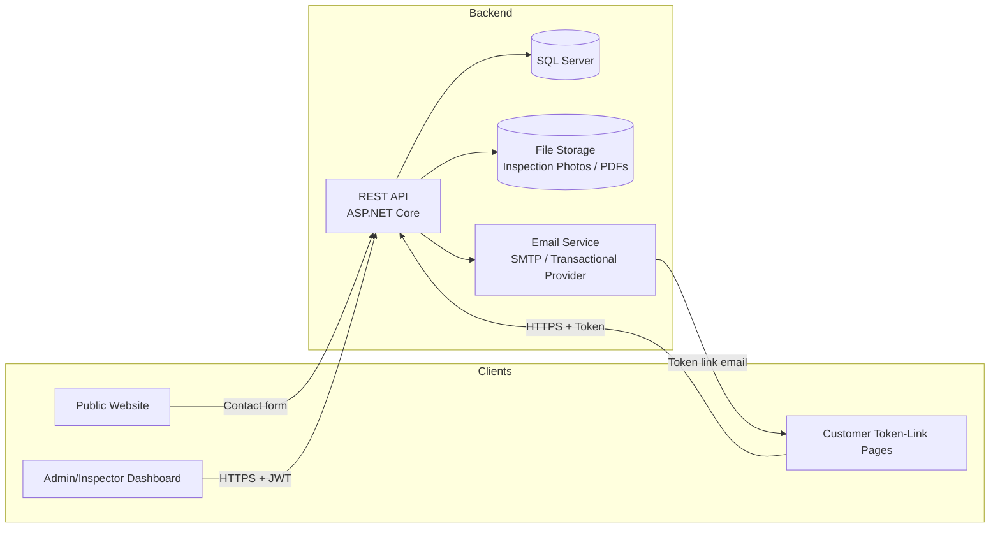

# Architecture Document

**Project:** RenoTrack — Renovation Company Website & Project-Tracking Dashboard
**Version:** 1.0
**Companion document:** SRS.md (functional requirements — read that first)

> This document is independent of, and unrelated to, any other project previously discussed (e.g. "RenoFlow"). It describes the technical architecture for this new system from scratch.

---

## 1. Goals & Principles

- **Ship a working v1, simply.** Favor a straightforward, well-structured monolith over premature microservices/multi-service complexity.
- **One backend, two front-ends.** A single source of truth (API + database) serves both the public Website and the internal Dashboard.
- **No customer accounts in v1.** Customer-facing interactions happen through secure, single-purpose token links — this shapes several architectural decisions below (§7).
- **Design for the one forward-looking requirement the Product Owner asked for:** the Invoice/Payment model must not need breaking changes when a real payment gateway is added later (SRS FR-8.5).
- **Keep it a real, portfolio-worthy codebase:** clean layering, consistent conventions, and a structure a reviewer can understand quickly.

---

## 2. High-Level Architecture



- **Public Website** — server-rendered pages (fast, SEO-friendly, no login). Submits the contact form to the API.
- **Dashboard** — a single-page application used by Admin and Inspector, authenticated with JWT.
- **Token-Link Pages** — a small set of public, unauthenticated pages (view Angebot, view Invoice, Approve/Reject) resolved by a token, not a login session. These can be served by the same Website project as simple routes, since they require no dashboard chrome.
- **API** — the single backend, owning all business logic and data access.
- **Database** — one relational database (SQL Server), one schema.
- **File Storage** — inspection photos and generated PDFs; local disk under a structured path for v1, with an abstraction that allows swapping to cloud blob storage later without touching business logic.
- **Email Service** — sends token links and internal notifications.

---

## 3. Solution Structure (Clean Architecture)

```
RenoTrack.sln
│
├── src/
│   ├── RenoTrack.Domain/            # Entities, enums, value objects, domain rules — no dependencies
│   ├── RenoTrack.Application/       # Use cases: Commands/Queries (CQRS-lite), DTOs, validators, interfaces
│   ├── RenoTrack.Infrastructure/    # EF Core, repositories, email sender, file storage, token-link service
│   ├── RenoTrack.Api/               # ASP.NET Core Web API — controllers/endpoints, auth, DI wiring
│   ├── RenoTrack.Dashboard/         # SPA front-end (Admin/Inspector)
│   └── RenoTrack.Website/           # Public site + token-link pages (server-rendered)
│
└── tests/
    ├── RenoTrack.Domain.Tests/          # References Domain only — proves it is testable in total isolation
    ├── RenoTrack.Application.Tests/
    ├── RenoTrack.Infrastructure.Tests/  # Added Phase 3 — real LocalDB integration tests, not in-memory fakes
    └── RenoTrack.Api.Tests/
```

`RenoTrack.Domain.Tests` is a project on its own, separate from `Application.Tests`, specifically so the dependency rule below is enforced by the build for tests too, not just production code: it references `RenoTrack.Domain` and nothing else, so it is structurally impossible for a "Domain test" to accidentally depend on Application-layer concerns (handlers, DTOs, validators). `RenoTrack.Infrastructure.Tests` was added as a deliberate Phase 3 addition (not part of the original Phase 0 structure above) specifically because neither `Domain.Tests`/`Application.Tests` (which test in isolation from any database) nor `Api.Tests` (which references only `RenoTrack.Api`, and Phase 4 hasn't built any endpoints yet) can exercise real EF Core/repository behavior — decimal precision, unique constraints, FK enforcement, backing-field collection navigation — the things Phase 3 specifically needs to verify.

**Dependency rule:** Domain has no dependencies. Application depends only on Domain. Infrastructure and API depend on Application (and, for wiring, on each other via DI at the composition root). Front-ends (Dashboard, Website) talk to the API only over HTTP — they never reference backend projects directly.

This mirrors standard Clean Architecture and keeps business rules (Angebot totals, VAT breakdown, workflow transitions) testable in the Application layer, independent of the database or web framework.

---

## 4. Technology Stack

| Layer | Choice | Rationale |
|---|---|---|
| Backend API | ASP.NET Core (Web API) | Strong typing, mature ecosystem, good fit for a structured business workflow like this |
| Dashboard | Angular (SPA) | Suited to a data-heavy, form-heavy internal tool with role-based views |
| Public Website | ASP.NET Core Razor Pages | Server-rendered, fast, SEO-friendly, simple content maintenance — no SPA overhead needed for a marketing site |
| Database | SQL Server + EF Core | Relational integrity fits invoicing/quoting data well; EF Core migrations give a clean audit trail of schema changes |
| Authentication | ASP.NET Core Identity (Admin/Inspector) + JWT bearer tokens for the Dashboard/API | Standard, well-understood, easy to reason about for two internal roles |
| Customer access | Custom Token-Link mechanism (not a full auth system) | Matches the "no customer accounts in v1" decision; simpler and more appropriate than issuing real accounts for one-time decisions |
| Email | SMTP or a transactional provider (e.g. SendGrid) behind an `IEmailSender` interface | Swappable without touching business logic |
| File Storage | Local disk (v1) behind an `IFileStorage` interface | Swappable for Azure Blob/S3 later with zero change to calling code |
| PDF Generation | Server-side HTML→PDF (e.g. a .NET PDF library) for Angebot/Invoice documents | Needed for email attachments and downloads |

---

## 5. API Design

### 5.1 Conventions
- RESTful resource-oriented routes, versioned from day one: `/api/v1/...`
- Standard HTTP verbs/status codes; errors returned as **RFC 7807 ProblemDetails** for consistency across the API.
- Pagination on list endpoints (`?page=`, `?pageSize=`), filtering by status/date/assignee where relevant (per SRS FR-2.4).
- CQRS-lite in the Application layer: one Command or Query class per use case, handled by a single handler — keeps each business operation isolated and testable (this is the same pattern used successfully on the previous project, and is proven to keep controllers thin).

### 5.2 Representative Endpoints

| Resource | Endpoint | Notes |
|---|---|---|
| Leads | `POST /api/v1/leads` | Public — used by the website contact form |
| Leads | `GET /api/v1/leads`, `GET /api/v1/leads/{id}` | Dashboard, Admin/Inspector (scoped) |
| Leads | `PATCH /api/v1/leads/{id}/status` | Admin |
| Inspections | `POST /api/v1/leads/{leadId}/inspections` | Admin schedules |
| Inspections | `POST /api/v1/inspections/{id}/photos` | Inspector uploads |
| Inspections | `POST /api/v1/inspections/{id}/complete` | Inspector |
| Angebote | `POST /api/v1/leads/{leadId}/angebote` | Inspector drafts |
| Angebote | `POST /api/v1/angebote/{id}/sections`, `.../items` | Inspector builds line items; `items` accepts an optional `catalogItemId` to pre-fill from Catalog (SRS FR-4.9) |
| Catalog | `GET /api/v1/catalog-items`, `POST /api/v1/catalog-items` | Admin manages; Inspector reads for selection while building an Angebot |
| Catalog | `POST /api/v1/angebot-items/{id}/save-as-catalog-item` | Inspector, one-click (SRS FR-4.10) |
| Angebote | `POST /api/v1/angebote/{id}/submit-for-review` | Inspector → Admin |
| Angebote | `POST /api/v1/angebote/{id}/approve`, `/request-changes`, `/send` | Admin |
| Angebot decision (public) | `GET /api/v1/public/angebote/{token}` | Token-link view, no auth |
| Angebot decision (public) | `POST /api/v1/public/angebote/{token}/decision` | Lead approves/rejects |
| Projects | `POST /api/v1/angebote/{id}/convert-to-project` | Admin |
| Invoices | `POST /api/v1/projects/{id}/invoices` | Admin |
| Invoices | `POST /api/v1/invoices/{id}/send`, `/mark-paid` | Admin |
| Invoice (public) | `GET /api/v1/public/invoices/{token}` | Token-link view, no auth |

### 5.3 Error Handling
All errors funnel through a single exception-handling middleware producing RFC 7807 `ProblemDetails` (type, title, status, detail, and a `traceId`), so both the Dashboard and any future client can handle errors uniformly.

---

## 6. Domain Model / Aggregates

Aggregate roots (each owns its child entities and is the only entry point for modifying them):

- **Lead** (root) — owns nothing directly beyond its own fields; references Inspection/Angebot by id.
- **Inspection** (root) → InspectionPhoto (child)
- **Angebot** (root) → AngebotSection (child) → AngebotItem (child)
- **CatalogItem** (root) — independent aggregate; an AngebotItem may optionally carry a `CatalogItemId` as a traceability link only (BR-8: no live reference, since editing a Catalog item must never retroactively change a past Angebot)
- **Customer** (root)
- **Project** (root) — references Customer, Angebot by id.
- **Invoice** (root) → InvoiceLine (child), Payment (child)
- **User** (root) — Admin/Inspector accounts
- **TokenLink** (root) — polymorphic reference to Angebot or Invoice via `EntityType` + `EntityId`

Child entities are only ever modified through their aggregate root (e.g. adding an AngebotItem goes through the Angebot aggregate), keeping totals/subtotals (Zwischensumme, Gesamtsumme, VAT breakdown) always consistent — this logic lives once, in the Angebot aggregate, not scattered across handlers.

### 6.1 Angebot Totals Calculation
Given the sample document's structure, the calculation logic (in the Application/Domain layer, unit-tested) is:
1. Each `AngebotItem.LineTotal = Quantity × UnitPrice`.
2. Each `AngebotSection.Subtotal = Σ(LineTotal)` of its items.
3. `Angebot.NetTotal = Σ(Subtotal)` across all sections.
4. `Angebot.VatBreakdown` = for each distinct VAT rate present among all items, `Σ(NetAmount at that rate) × rate` — matching the sample's "zzgl. 0% MwSt / zzgl. 16% MwSt / zzgl. 19% MwSt" lines.
5. `Angebot.GrossTotal = NetTotal + Σ(VatBreakdown amounts)`.

This same calculation is reused for Invoices, since an Invoice is essentially a partial re-statement of the Angebot's amounts.

`AngebotItem.LineTotal` and `AngebotSection.Subtotal` are computed properties, never stored fields on the in-memory Domain object — recomputed from their children on every access, so they can never drift out of sync. `Angebot.NetTotal`/`GrossTotal` are the only cached/stored fields in this tree (matching ERD.md's documented columns), specifically because the ERD's own stated reason — fast list-page rendering (Wireframes.md B2) — applies only at the Angebot level, not to individual items/sections which are never displayed independently of their parent. The VAT-rate breakdown has no ERD column at all and is likewise always computed on demand from the live `AngebotItem` collection, never cached.

### 6.2 Domain aggregate design decisions recorded during implementation

**Lead status transitions live on the Lead aggregate itself, guarded only by Lead's own current status.** BR-7 requires every status change to happen through an explicit, named action. StateMachine.md §1.3's guard column mixes two different kinds of condition: some are checkable from Lead's own state alone (e.g. "is Status currently New?"), others depend on another aggregate or external state entirely (e.g. "Inspection belongs to this Lead", "no other open Angebot exists", "TokenLink valid & unused"). The Lead aggregate enforces only the former — a self-guard on its own current `Status` — for every transition method (`MarkInspectionScheduled`, `MarkInspectionDone`, `MarkAngebotInProgress`, `MarkAngebotSent`, `MarkWon`, `MarkLost`). The latter kind of condition is the Application layer's responsibility: it performs the operation on the other aggregate first (e.g. `SendAngebotCommand` on Angebot, or validating a TokenLink), and only calls the matching Lead transition method once that has already succeeded. This keeps each aggregate's invariants owned by itself, with cross-aggregate coordination living in the Application layer rather than as direct coupling between aggregates — Lead has zero compile-time knowledge of Inspection, Angebot, or TokenLink as types.

**`Lead.AssignInspector(inspectorId)` is deliberately not part of the Lead state machine.** Assigning or reassigning the Inspector responsible for a Lead (PermissionMatrix.md §1) is an administrative action, not a lifecycle transition — neither StateMachine.md nor PermissionMatrix.md places any restriction on when it may happen. The method therefore carries no `LeadStatus` guard and never changes `Status`. This is an intentional choice: adding a status restriction here would be inventing a new business rule rather than encoding one that already exists in the source documents. If a future requirement introduces such a restriction, it should be added as a new numbered rule in BusinessRules.md first.

**`Angebot.AddItemToSection` takes the target `AngebotSection` object itself, not a `sectionId` int, because entity identity isn't stable yet at the Domain layer.** `Id` on every entity in this Domain is assigned later, by EF Core at persistence time (Phase 3) — before that, every freshly-created `AngebotSection` in a given `Angebot` shares `Id == 0`, so an id-based lookup within `_sections` cannot reliably distinguish between them (it would silently always resolve to whichever section happens to match first). Passing the section instance itself sidesteps this entirely, since object identity doesn't depend on persistence having happened. `AddItemToSection` still verifies the given section actually belongs to the aggregate it's called on (`_sections.Contains(section)`), so the aggregate boundary is enforced regardless. Once Phase 3 assigns real ids, the Application layer resolves which section a request targets (e.g. from a route id) by reading the already-loaded `Sections` collection and passing that resolved instance in — this signature does not need to change then.

**`Angebot` is the only public entry point for modifying its Sections and Items — `AngebotSection.AddItem` is not public.** Sequence Diagram §4's pseudocode shows `section.AddItem(...)` and `angebot.RecalculateTotals()` as two separate calls, which read literally would let the Application layer add an item without ever triggering the Angebot-level totals recalculation. Since Architecture §6 already states child entities are only ever modified through their aggregate root, the sequence diagram is treated here as a conceptual description of *what* happens, not a literal specification of *which* methods are public. `AngebotSection`'s constructor and `AddItem` method are both `internal`, reachable only from within `RenoTrack.Domain` (in practice, only from `Angebot`'s own methods, e.g. `AddSection`/`AddItemToSection`), which wrap the child mutation and the resulting `RecalculateTotals()` call inside one atomic public operation. This is an aggregate-consistency mechanism, not a new business rule — nothing here changes what the system does, only how the invariant that NetTotal/GrossTotal are always current is structurally guaranteed rather than left to caller discipline.

---

## 7. Authentication & Authorization

### 7.1 Admin/Inspector (Dashboard)
- ASP.NET Core Identity for user storage (hashed passwords, lockout policy).
- JWT bearer tokens issued on login, short-lived access token + refresh token pattern.
- Role claim (`Admin` / `Inspector`) drives authorization: `[Authorize(Roles = "Admin")]` on Admin-only endpoints (e.g. approve Angebot, manage invoices); Inspectors are further scoped to their own assigned Leads/Inspections/Angebot-drafts at the query level (not just via role, since two Inspectors share the same role).

### 7.2 Customer Token Links (No Account)
- A `TokenLink` record stores: `EntityType` (Angebot/Invoice), `EntityId`, a cryptographically random `Token` (e.g. 32-byte, URL-safe base64), `ExpiresAt`, and `UsedAt`.
- The public endpoints (`/api/v1/public/...`) look up the record by token only — no user identity is ever established for the customer. This deliberately keeps the customer-facing surface area small and easy to secure, versus building a lighter-weight parallel authentication system.
- On a state-changing action (Approve/Reject a decision), the endpoint sets `UsedAt` so the same link cannot be used twice for a decision; viewing remains possible (or can be cut off too, per OQ resolution).
- Tokens are single-purpose (tied to one entity) rather than session-based, which keeps the blast radius of a leaked link limited to that one Angebot or Invoice.

### 7.3 Role authorization vs. resource ownership — where each is enforced

Two different concerns are both loosely called "authorization" but belong in different layers, and Phase 2 handler design draws a firm line between them:

- **Role-based authorization** ("is this caller an Admin/Inspector at all?") is an API-layer concern: `[Authorize(Roles = "...")]` attributes (§7.1), enforced before a request ever reaches a handler. It needs no domain data — the JWT's role claim is enough.
- **Resource ownership rules** ("is this caller *the specific* Inspector this Inspection/Lead is assigned to?", not just *an* Inspector) are an Application-layer concern, not an authorization attribute. They cannot be decided from a role claim alone — they require the loaded aggregate (e.g. `Inspection.InspectorId`) to compare against. Since the handler already loads that aggregate to do its real work, checking ownership there (and throwing a `ForbiddenException`, mapped to 403 by the API middleware, §5.3) avoids re-loading the same data in a separate authorization layer. This is treated as a business invariant of the use case, not bolted-on access control — PermissionMatrix.md's "S" (scoped) rows are exactly the actions this applies to (e.g. "Mark Inspection complete — Inspector, assigned Inspector only").

---

## 8. Numbering & Sequences

- **Angebot numbers:** generated as `ANG-{YYYY}-{sequence:D5}` via a small `INumberGeneratorService`, backed by a `NumberSequence` table (per-year counter). The increment is **not** performed inside the same DB transaction as the Angebot creation — `CreateAngebotCommandHandler` calls `NextAngebotNumberAsync` before the `Angebot` entity even exists in memory, so true same-transaction participation isn't achievable without restructuring that handler. Instead, uniqueness under concurrent writes is guaranteed by a single, independently-committed atomic SQL statement (`UPDATE ... OUTPUT`, a row-level exclusive lock held only for that one statement) — see `ARCHITECTURE_DECISIONS.md` D52 for the full reasoning, including why EF Core's read/track/write model cannot express this as one atomic operation. Gaps in Angebot numbering are acceptable (no `BusinessRules.md` rule forbids them, unlike Invoice numbers below).
- **Invoice numbers:** same mechanism, its own sequence, formatted per the company's preferred convention (e.g. `RE-{YYYY}-{sequence:D5}`) — sequential numbering is a legal requirement for German invoices (SRS BR-5), so this must never skip or reuse numbers, even if an Invoice is later voided (void, don't delete).

---

## 9. File Storage Strategy

- v1: photos and generated PDFs are stored on local disk under a structured path (e.g. `/storage/inspections/{inspectionId}/{fileId}.jpg`), served back through an authenticated API endpoint rather than direct static file exposure (so Inspector-scoped access rules still apply).
- All file access goes through an `IFileStorage` interface (`SaveAsync`, `GetAsync`, `DeleteAsync`) implemented by a `LocalDiskFileStorage` class in Infrastructure. A future `AzureBlobFileStorage` (or S3 equivalent) implementation can be swapped in via DI with no change to calling code — this satisfies "keep it simple now, without painting ourselves into a corner."
- **The Application layer is responsible for generating stable external resource identifiers before invoking external infrastructure, when doing so improves workflow consistency.** Discovered while implementing `UploadInspectionPhotoCommand` (Phase 2): the handler generates the photo's `FileUrl` itself (a GUID-based key) and passes it to `Inspection.AddPhoto(fileUrl, ...)` — which enforces BR-10 — *before* calling `IFileStorage.SaveAsync`, rather than letting the storage call invent and return a URL after the fact. This means a rejected business rule is caught before any irreversible external I/O runs, with no new Domain state exposed solely to ask "is this operation currently allowed" — the single existing invariant just runs earlier in the sequence. The same shape will likely recur for invoice PDFs, generated documents, or any other case where a Domain aggregate needs to reference a not-yet-created external resource by a value it can validate up front.

---

## 10. Email / Notification Service

- `IEmailSender` interface in Application, implemented in Infrastructure against SMTP or a transactional provider (decision point — see SRS OQ-3).
- Templates (German) for: Angebot token link, Invoice token link, "new website Lead" (to Admin), "Angebot submitted for review" (to Admin), "Lead decision received" (to Admin).
- Sending is fire-and-forget from the API's perspective but should be queued/retried on failure (even a simple in-process retry/background job is enough for v1 — no separate message broker needed at this scale).

---

## 11. Database Design Notes

- SQL Server, EF Core Code-First with migrations checked into source control (clear history of schema evolution — useful for a portfolio repo).
- Monetary values stored as `decimal(18,2)`; VAT rate stored as `decimal(5,2)` (percentage) or as a small enum of allowed rates (0/7/16/19) per BR-6 — enum is simpler and safer for v1 given the company's real documents only use a known small set of rates.
- Soft status fields (enums) rather than free-text, to keep pipeline reporting reliable (SRS FR-2.4).
- Audit log as an independent table (`AuditLog`), written by a small `IAuditService` called from handlers at key transition points (mirrors the proven pattern from the earlier project).
- **`AuditLog` has no cross-entity linkage** — only `EntityType`/`EntityId` (ERD.md), with a recommended index on exactly that pair "for fetching an entity's full history efficiently." There is no separate column (e.g. a `LeadId` on an Inspection-typed row) that would let a query recover "everything that happened around this Lead" from child-entity rows. Combined with Wireframe C1's per-Lead "Activity Timeline" being the only documented audit UI, this settles a question that recurs across many Phase 2 handlers: **when a use case's real side effect is a business-meaningful transition on one aggregate (e.g. a Lead moving to `InspectionScheduled`), even though a *different* aggregate is what got created (e.g. the `Inspection` row), the audit entry is logged against the aggregate whose state the business cares about (`Lead`), not the incidentally-created entity** — otherwise that event would never surface on the one audit UI the docs actually describe. This is why `ScheduleInspectionCommandHandler` logs `entityType: nameof(Lead)` even though it also creates an `Inspection`.

---

## 12. Security Considerations

- HTTPS enforced everywhere (website, dashboard, API, token links).
- Token-link tokens: cryptographically random, not derived from predictable data (e.g. not `entityId + timestamp`).
- Rate limiting / basic abuse protection on public endpoints (`/api/v1/public/...` and the contact form) to prevent scraping or brute-forcing token guesses.
- Standard input validation (FluentValidation or similar) on every Command, both for internal (Dashboard) and public (token-link) endpoints.
- CORS configured narrowly (Dashboard origin, Website origin) — public token-link endpoints are the only ones intentionally exposed beyond that.
- GDPR: Lead/Customer personal data has a clear owner (the company); data export/delete procedures can be a manual Admin-assisted process for v1 (no need for a self-service data portal at this stage).

---

## 13. Deployment

- v1 target: a single Azure App Service (or equivalent VPS) hosting the API, plus the Dashboard and Website as static/served front-ends (Dashboard build output can be served by the same host or a separate static hosting target; Website is server-rendered by the same ASP.NET Core process or a sibling one).
- One SQL Server database (Azure SQL or a managed SQL Server instance).
- Environments: `Development` (local), `Staging` (optional), `Production`.
- Configuration (connection strings, email provider keys, JWT signing key) via environment variables / `appsettings.{Environment}.json` + secrets manager — never committed to source control.

---

## 14. Build Roadmap (Suggested Phases)

Kept intentionally small and sequential, so each phase is a shippable, demoable increment:

| Phase | Deliverable |
|---|---|
| 0 | Solution bootstrap: Clean Architecture skeleton, CI build, empty DB migration |
| 1 | Domain + Application: Lead, Inspection, Angebot (with sections/items) — the calculation core, unit-tested |
| 1b | Domain + Application: CatalogItem, and the "create AngebotItem from Catalog" / "save as Catalog item" use cases |
| 2 | Infrastructure: EF Core repositories, DB schema, Identity setup |
| 3 | API: Lead + Inspection endpoints, Auth (login, JWT) |
| 4 | API: Angebot builder + review workflow endpoints |
| 5 | Token-link mechanism + public Angebot decision endpoints |
| 6 | Project conversion + Invoice creation/splitting endpoints |
| 7 | Email service integration (token links + internal notifications) |
| 8 | Dashboard (Angular): Lead pipeline, Inspection screen, Angebot builder UI |
| 9 | Dashboard: Review workflow UI, Project/Invoice management UI |
| 10 | Public Website (Razor Pages): marketing pages, contact form, token-link customer pages |
| 11 | PDF generation for Angebot/Invoice |
| 12 | Polish: audit log UI, filtering/search, German legal pages (Impressum/Datenschutz) |

---

## 15. Non-Goals for v1 (Architectural)

- No microservices — one API, one database.
- No message broker/event bus — direct synchronous calls and simple retry logic are sufficient at this scale.
- No customer identity provider — token links only (§7.2).
- No payment gateway SDK integration — only a data model that won't need to change when one is added (SRS FR-8.5, Architecture §6.1's Invoice reuse of Angebot math already positions this well).
- No multi-tenancy — the schema assumes one company.
