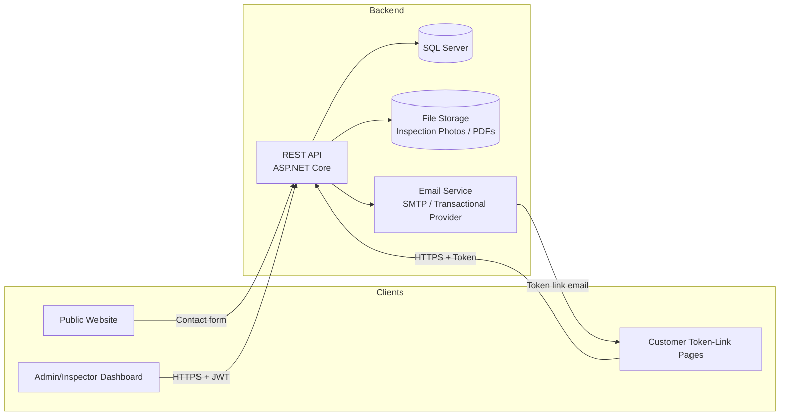

# Architecture Document

**Project:** RenoTrack — Renovation Company Website & Project-Tracking Dashboard
**Version:** 1.0
**Companion document:** SRS.md (functional requirements — read that first)

> This document is independent of, and unrelated to, any other project previously discussed (e.g. "RenoFlow"). It describes the technical architecture for this new system from scratch.

---

## 1. Goals & Principles

- **Ship a working v1, simply.** Favor a straightforward, well-structured monolith over premature microservices/multi-service complexity.
- **One backend, two front-ends.** A single source of truth (API + database) serves both the public Website and the internal Dashboard.
- **No customer accounts in v1.** Customer-facing interactions happen through secure, single-purpose token links — this shapes several architectural decisions below (§7).
- **Design for the one forward-looking requirement the Product Owner asked for:** the Invoice/Payment model must not need breaking changes when a real payment gateway is added later (SRS FR-8.5).
- **Keep it a real, portfolio-worthy codebase:** clean layering, consistent conventions, and a structure a reviewer can understand quickly.

---

## 2. High-Level Architecture



- **Public Website** — server-rendered pages (fast, SEO-friendly, no login). Submits the contact form to the API.
- **Dashboard** — a single-page application used by Admin and Inspector, authenticated with JWT.
- **Token-Link Pages** — a small set of public, unauthenticated pages (view Angebot, view Invoice, Approve/Reject) resolved by a token, not a login session. These can be served by the same Website project as simple routes, since they require no dashboard chrome.
- **API** — the single backend, owning all business logic and data access.
- **Database** — one relational database (SQL Server), one schema.
- **File Storage** — inspection photos and generated PDFs; local disk under a structured path for v1, with an abstraction that allows swapping to cloud blob storage later without touching business logic.
- **Email Service** — sends token links and internal notifications.

---

## 3. Solution Structure (Clean Architecture)

```
RenoTrack.sln
│
├── src/
│   ├── RenoTrack.Domain/            # Entities, enums, value objects, domain rules — no dependencies
│   ├── RenoTrack.Application/       # Use cases: Commands/Queries (CQRS-lite), DTOs, validators, interfaces
│   ├── RenoTrack.Infrastructure/    # EF Core, repositories, email sender, file storage, token-link service
│   ├── RenoTrack.Api/               # ASP.NET Core Web API — controllers/endpoints, auth, DI wiring
│   ├── RenoTrack.Dashboard/         # SPA front-end (Admin/Inspector)
│   └── RenoTrack.Website/           # Public site + token-link pages (server-rendered)
│
└── tests/
    ├── RenoTrack.Application.Tests/
    └── RenoTrack.Api.Tests/
```

**Dependency rule:** Domain has no dependencies. Application depends only on Domain. Infrastructure and API depend on Application (and, for wiring, on each other via DI at the composition root). Front-ends (Dashboard, Website) talk to the API only over HTTP — they never reference backend projects directly.

This mirrors standard Clean Architecture and keeps business rules (Angebot totals, VAT breakdown, workflow transitions) testable in the Application layer, independent of the database or web framework.

---

## 4. Technology Stack

| Layer | Choice | Rationale |
|---|---|---|
| Backend API | ASP.NET Core (Web API) | Strong typing, mature ecosystem, good fit for a structured business workflow like this |
| Dashboard | Angular (SPA) | Suited to a data-heavy, form-heavy internal tool with role-based views |
| Public Website | ASP.NET Core Razor Pages | Server-rendered, fast, SEO-friendly, simple content maintenance — no SPA overhead needed for a marketing site |
| Database | SQL Server + EF Core | Relational integrity fits invoicing/quoting data well; EF Core migrations give a clean audit trail of schema changes |
| Authentication | ASP.NET Core Identity (Admin/Inspector) + JWT bearer tokens for the Dashboard/API | Standard, well-understood, easy to reason about for two internal roles |
| Customer access | Custom Token-Link mechanism (not a full auth system) | Matches the "no customer accounts in v1" decision; simpler and more appropriate than issuing real accounts for one-time decisions |
| Email | SMTP or a transactional provider (e.g. SendGrid) behind an `IEmailSender` interface | Swappable without touching business logic |
| File Storage | Local disk (v1) behind an `IFileStorage` interface | Swappable for Azure Blob/S3 later with zero change to calling code |
| PDF Generation | Server-side HTML→PDF (e.g. a .NET PDF library) for Angebot/Invoice documents | Needed for email attachments and downloads |

---

## 5. API Design

### 5.1 Conventions
- RESTful resource-oriented routes, versioned from day one: `/api/v1/...`
- Standard HTTP verbs/status codes; errors returned as **RFC 7807 ProblemDetails** for consistency across the API.
- Pagination on list endpoints (`?page=`, `?pageSize=`), filtering by status/date/assignee where relevant (per SRS FR-2.4).
- CQRS-lite in the Application layer: one Command or Query class per use case, handled by a single handler — keeps each business operation isolated and testable (this is the same pattern used successfully on the previous project, and is proven to keep controllers thin).

### 5.2 Representative Endpoints

| Resource | Endpoint | Notes |
|---|---|---|
| Leads | `POST /api/v1/leads` | Public — used by the website contact form |
| Leads | `GET /api/v1/leads`, `GET /api/v1/leads/{id}` | Dashboard, Admin/Inspector (scoped) |
| Leads | `PATCH /api/v1/leads/{id}/status` | Admin |
| Inspections | `POST /api/v1/leads/{leadId}/inspections` | Admin schedules |
| Inspections | `POST /api/v1/inspections/{id}/photos` | Inspector uploads |
| Inspections | `POST /api/v1/inspections/{id}/complete` | Inspector |
| Angebote | `POST /api/v1/leads/{leadId}/angebote` | Inspector drafts |
| Angebote | `POST /api/v1/angebote/{id}/sections`, `.../items` | Inspector builds line items; `items` accepts an optional `catalogItemId` to pre-fill from Catalog (SRS FR-4.9) |
| Catalog | `GET /api/v1/catalog-items`, `POST /api/v1/catalog-items` | Admin manages; Inspector reads for selection while building an Angebot |
| Catalog | `POST /api/v1/angebot-items/{id}/save-as-catalog-item` | Inspector, one-click (SRS FR-4.10) |
| Angebote | `POST /api/v1/angebote/{id}/submit-for-review` | Inspector → Admin |
| Angebote | `POST /api/v1/angebote/{id}/approve`, `/request-changes`, `/send` | Admin |
| Angebot decision (public) | `GET /api/v1/public/angebote/{token}` | Token-link view, no auth |
| Angebot decision (public) | `POST /api/v1/public/angebote/{token}/decision` | Lead approves/rejects |
| Projects | `POST /api/v1/angebote/{id}/convert-to-project` | Admin |
| Invoices | `POST /api/v1/projects/{id}/invoices` | Admin |
| Invoices | `POST /api/v1/invoices/{id}/send`, `/mark-paid` | Admin |
| Invoice (public) | `GET /api/v1/public/invoices/{token}` | Token-link view, no auth |

### 5.3 Error Handling
All errors funnel through a single exception-handling middleware producing RFC 7807 `ProblemDetails` (type, title, status, detail, and a `traceId`), so both the Dashboard and any future client can handle errors uniformly.

---

## 6. Domain Model / Aggregates

Aggregate roots (each owns its child entities and is the only entry point for modifying them):

- **Lead** (root) — owns nothing directly beyond its own fields; references Inspection/Angebot by id.
- **Inspection** (root) → InspectionPhoto (child)
- **Angebot** (root) → AngebotSection (child) → AngebotItem (child)
- **CatalogItem** (root) — independent aggregate; an AngebotItem may optionally carry a `CatalogItemId` as a traceability link only (BR-8: no live reference, since editing a Catalog item must never retroactively change a past Angebot)
- **Customer** (root)
- **Project** (root) — references Customer, Angebot by id.
- **Invoice** (root) → InvoiceLine (child), Payment (child)
- **User** (root) — Admin/Inspector accounts
- **TokenLink** (root) — polymorphic reference to Angebot or Invoice via `EntityType` + `EntityId`

Child entities are only ever modified through their aggregate root (e.g. adding an AngebotItem goes through the Angebot aggregate), keeping totals/subtotals (Zwischensumme, Gesamtsumme, VAT breakdown) always consistent — this logic lives once, in the Angebot aggregate, not scattered across handlers.

### 6.1 Angebot Totals Calculation
Given the sample document's structure, the calculation logic (in the Application/Domain layer, unit-tested) is:
1. Each `AngebotItem.LineTotal = Quantity × UnitPrice`.
2. Each `AngebotSection.Subtotal = Σ(LineTotal)` of its items.
3. `Angebot.NetTotal = Σ(Subtotal)` across all sections.
4. `Angebot.VatBreakdown` = for each distinct VAT rate present among all items, `Σ(NetAmount at that rate) × rate` — matching the sample's "zzgl. 0% MwSt / zzgl. 16% MwSt / zzgl. 19% MwSt" lines.
5. `Angebot.GrossTotal = NetTotal + Σ(VatBreakdown amounts)`.

This same calculation is reused for Invoices, since an Invoice is essentially a partial re-statement of the Angebot's amounts.

---

## 7. Authentication & Authorization

### 7.1 Admin/Inspector (Dashboard)
- ASP.NET Core Identity for user storage (hashed passwords, lockout policy).
- JWT bearer tokens issued on login, short-lived access token + refresh token pattern.
- Role claim (`Admin` / `Inspector`) drives authorization: `[Authorize(Roles = "Admin")]` on Admin-only endpoints (e.g. approve Angebot, manage invoices); Inspectors are further scoped to their own assigned Leads/Inspections/Angebot-drafts at the query level (not just via role, since two Inspectors share the same role).

### 7.2 Customer Token Links (No Account)
- A `TokenLink` record stores: `EntityType` (Angebot/Invoice), `EntityId`, a cryptographically random `Token` (e.g. 32-byte, URL-safe base64), `ExpiresAt`, and `UsedAt`.
- The public endpoints (`/api/v1/public/...`) look up the record by token only — no user identity is ever established for the customer. This deliberately keeps the customer-facing surface area small and easy to secure, versus building a lighter-weight parallel authentication system.
- On a state-changing action (Approve/Reject a decision), the endpoint sets `UsedAt` so the same link cannot be used twice for a decision; viewing remains possible (or can be cut off too, per OQ resolution).
- Tokens are single-purpose (tied to one entity) rather than session-based, which keeps the blast radius of a leaked link limited to that one Angebot or Invoice.

---

## 8. Numbering & Sequences

- **Angebot numbers:** generated as `ANG-{YYYY}-{sequence:D5}` via a small `INumberGeneratorService`, backed by a `NumberSequence` table (per-year counter), avoiding numbering collisions under concurrent writes (sequence increment done inside the same DB transaction as the Angebot creation).
- **Invoice numbers:** same mechanism, its own sequence, formatted per the company's preferred convention (e.g. `RE-{YYYY}-{sequence:D5}`) — sequential numbering is a legal requirement for German invoices (SRS BR-5), so this must never skip or reuse numbers, even if an Invoice is later voided (void, don't delete).

---

## 9. File Storage Strategy

- v1: photos and generated PDFs are stored on local disk under a structured path (e.g. `/storage/inspections/{inspectionId}/{fileId}.jpg`), served back through an authenticated API endpoint rather than direct static file exposure (so Inspector-scoped access rules still apply).
- All file access goes through an `IFileStorage` interface (`SaveAsync`, `GetAsync`, `DeleteAsync`) implemented by a `LocalDiskFileStorage` class in Infrastructure. A future `AzureBlobFileStorage` (or S3 equivalent) implementation can be swapped in via DI with no change to calling code — this satisfies "keep it simple now, without painting ourselves into a corner."

---

## 10. Email / Notification Service

- `IEmailSender` interface in Application, implemented in Infrastructure against SMTP or a transactional provider (decision point — see SRS OQ-3).
- Templates (German) for: Angebot token link, Invoice token link, "new website Lead" (to Admin), "Angebot submitted for review" (to Admin), "Lead decision received" (to Admin).
- Sending is fire-and-forget from the API's perspective but should be queued/retried on failure (even a simple in-process retry/background job is enough for v1 — no separate message broker needed at this scale).

---

## 11. Database Design Notes

- SQL Server, EF Core Code-First with migrations checked into source control (clear history of schema evolution — useful for a portfolio repo).
- Monetary values stored as `decimal(18,2)`; VAT rate stored as `decimal(5,2)` (percentage) or as a small enum of allowed rates (0/7/16/19) per BR-6 — enum is simpler and safer for v1 given the company's real documents only use a known small set of rates.
- Soft status fields (enums) rather than free-text, to keep pipeline reporting reliable (SRS FR-2.4).
- Audit log as an independent table (`AuditLog`), written by a small `IAuditService` called from handlers at key transition points (mirrors the proven pattern from the earlier project).

---

## 12. Security Considerations

- HTTPS enforced everywhere (website, dashboard, API, token links).
- Token-link tokens: cryptographically random, not derived from predictable data (e.g. not `entityId + timestamp`).
- Rate limiting / basic abuse protection on public endpoints (`/api/v1/public/...` and the contact form) to prevent scraping or brute-forcing token guesses.
- Standard input validation (FluentValidation or similar) on every Command, both for internal (Dashboard) and public (token-link) endpoints.
- CORS configured narrowly (Dashboard origin, Website origin) — public token-link endpoints are the only ones intentionally exposed beyond that.
- GDPR: Lead/Customer personal data has a clear owner (the company); data export/delete procedures can be a manual Admin-assisted process for v1 (no need for a self-service data portal at this stage).

---

## 13. Deployment

- v1 target: a single Azure App Service (or equivalent VPS) hosting the API, plus the Dashboard and Website as static/served front-ends (Dashboard build output can be served by the same host or a separate static hosting target; Website is server-rendered by the same ASP.NET Core process or a sibling one).
- One SQL Server database (Azure SQL or a managed SQL Server instance).
- Environments: `Development` (local), `Staging` (optional), `Production`.
- Configuration (connection strings, email provider keys, JWT signing key) via environment variables / `appsettings.{Environment}.json` + secrets manager — never committed to source control.

---

## 14. Build Roadmap (Suggested Phases)

Kept intentionally small and sequential, so each phase is a shippable, demoable increment:

| Phase | Deliverable |
|---|---|
| 0 | Solution bootstrap: Clean Architecture skeleton, CI build, empty DB migration |
| 1 | Domain + Application: Lead, Inspection, Angebot (with sections/items) — the calculation core, unit-tested |
| 1b | Domain + Application: CatalogItem, and the "create AngebotItem from Catalog" / "save as Catalog item" use cases |
| 2 | Infrastructure: EF Core repositories, DB schema, Identity setup |
| 3 | API: Lead + Inspection endpoints, Auth (login, JWT) |
| 4 | API: Angebot builder + review workflow endpoints |
| 5 | Token-link mechanism + public Angebot decision endpoints |
| 6 | Project conversion + Invoice creation/splitting endpoints |
| 7 | Email service integration (token links + internal notifications) |
| 8 | Dashboard (Angular): Lead pipeline, Inspection screen, Angebot builder UI |
| 9 | Dashboard: Review workflow UI, Project/Invoice management UI |
| 10 | Public Website (Razor Pages): marketing pages, contact form, token-link customer pages |
| 11 | PDF generation for Angebot/Invoice |
| 12 | Polish: audit log UI, filtering/search, German legal pages (Impressum/Datenschutz) |

---

## 15. Non-Goals for v1 (Architectural)

- No microservices — one API, one database.
- No message broker/event bus — direct synchronous calls and simple retry logic are sufficient at this scale.
- No customer identity provider — token links only (§7.2).
- No payment gateway SDK integration — only a data model that won't need to change when one is added (SRS FR-8.5, Architecture §6.1's Invoice reuse of Angebot math already positions this well).
- No multi-tenancy — the schema assumes one company.
