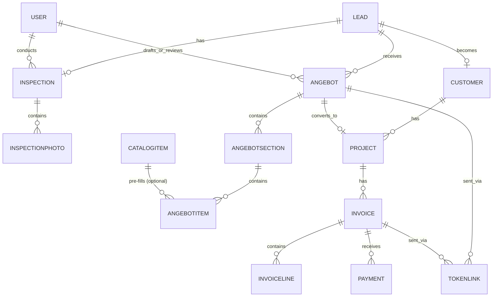
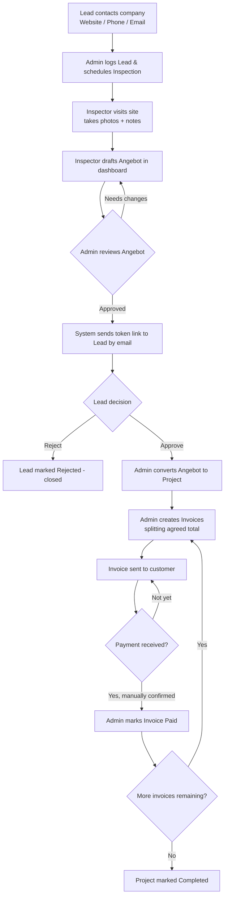

# Software Requirements Specification (SRS)

**Project:** RenoTrack — Renovation Company Website & Project-Tracking Dashboard
**Version:** 1.0
**Status:** Draft for review
**Prepared by:** Business Analyst (Claude), in collaboration with the Product Owner
**Document type:** Functional & business requirements (IEEE 830–style)

> This document is independent of, and unrelated to, any other project previously discussed (e.g. "RenoFlow"). It describes a new system from scratch.

---

## 1. Introduction

### 1.1 Purpose
This SRS defines the functional and non-functional requirements for a two-part system built for a German home-renovation/tiling ("Fliesen") company:

1. A **public marketing website** representing the company to visitors and prospective customers.
2. An internal **Project-Tracking Dashboard** used by the company's staff (Admin and Inspector) to manage the entire customer journey — from first contact to project handover — including the digital creation of **Angebote** (quotes) and **Rechnungen** (invoices).

The dashboard is the primary deliverable. Its core business goal is to eliminate the 3–4 hours per document the company currently spends manually filling out Angebote and Rechnungen in Word/Excel, and to give the company a single source of truth for where every Lead and every Project stands.

### 1.2 Scope
**In scope (v1 / MVP):**
- Public website with services, portfolio, and a contact form that creates a Lead.
- Lead capture from three channels: website form, phone call (manually logged by Admin), email (manually logged by Admin).
- Inspection scheduling and on-site data capture (photos + notes).
- Digital Angebot builder mirroring the structure of the company's real paper Angebot (sections → line items → subtotals → VAT summary → grand total).
- A **Catalog of reusable line items** so the Inspector can pick pre-filled, commonly-used items instead of retyping full specifications each time — this is the feature most directly responsible for actually cutting the 3–4 hour manual fill-in time down to minutes.
- Angebot internal review loop between Inspector and Admin.
- Sending the Angebot to the Lead via a secure, no-login token link; Lead can Approve or Reject.
- Conversion of an approved Angebot into a Project.
- Splitting the agreed Angebot total into an arbitrary number of Invoices (Rechnungen) tied to project milestones.
- Manual payment tracking for invoices (bank transfer / cash), with the data model designed so a real payment gateway can be added later without breaking changes.
- Admin/Inspector authentication and role-based dashboard access.
- Full activity/audit trail of a Lead's journey.

**Out of scope (v1 — explicitly deferred, see §9):**
- Customer accounts / customer login (v1 uses token links only).
- Online payment gateway integration (Stripe/PayPal, etc.) — structure only, not implementation.
- Multi-company / multi-tenant support (this system serves one company).
- Native mobile apps (the dashboard is a responsive web app).
- Multi-language website (German only for v1, unless stated otherwise).

### 1.3 Definitions, Acronyms, Abbreviations

| Term | Meaning |
|---|---|
| Lead | A person/household who has expressed interest but is not yet a paying customer |
| Inspector | Staff member who visits the site, takes photos/notes, and drafts the Angebot |
| Admin | Staff member who reviews Angebote, manages invoices, and is the final approver internally |
| Angebot | A formal, itemized quote/offer sent to the Lead (German commercial document) |
| Rechnung / Invoice | A formal, itemized bill sent to the Customer for a Project or part of it |
| Token Link | A unique, unguessable, expiring URL sent by email that lets a Lead/Customer view and act on a specific Angebot or Invoice without creating an account |
| Zwischensumme | Section subtotal within an Angebot |
| MwSt | Mehrwertsteuer — German VAT |
| Project | A Lead's job after the Angebot has been approved and work is underway |

### 1.4 References
- Sample real-world Angebot document provided by the Product Owner (ANG-FLS-10093, ASS Fliesenleger), used as the structural template for the digital Angebot (sections, line items, quantities/units, subtotals, VAT breakdown by rate, grand total).
- German invoicing legal requirements (UStG §14) — see §6.4 Business Rules.

---

## 2. Overall Description

### 2.1 Product Perspective
This is a new, standalone system: a public website, an internal dashboard, and the backend API/database that powers both. There is no dependency on any pre-existing system.

### 2.2 Product Functions (Summary)
- Present the company and its services to the public (Website).
- Capture and centralize Leads regardless of channel (Dashboard).
- Schedule and document on-site inspections (Dashboard).
- Build, review, and send Angebote digitally (Dashboard).
- Track Lead decisions and convert approved Angebote into Projects (Dashboard).
- Generate and track Invoices/payments per Project (Dashboard).
- Give the Admin full visibility into every stage, for every Lead, at any time (Dashboard).

### 2.3 User Classes and Characteristics

| User Class | Description | Technical Skill |
|---|---|---|
| Public Visitor | Anyone browsing the website | None assumed |
| Lead / Customer | A prospective or active customer, interacts only via email + token links | None assumed — must work with just a browser and a link |
| Inspector | Field staff; visits sites, drafts Angebote in the dashboard | Basic computer literacy |
| Admin | Reviews/approves Angebote, manages invoices and the full pipeline; owns the business relationship | Basic-to-intermediate computer literacy |

### 2.4 Operating Environment
- Website and Dashboard: modern web browsers (desktop and mobile), no native app required.
- Dashboard is used primarily on desktop/tablet by staff, but must be usable on a phone by the Inspector on-site (for uploading photos, at minimum).
- Backend hosted on a server/cloud environment reachable over HTTPS.

### 2.5 Design and Implementation Constraints
- The system must be simple to operate for non-technical staff — clear task lists, minimal clicks per common action.
- Must comply with German commercial/legal requirements for Angebote and Rechnungen (mandatory invoice fields, VAT handling — see §6.4).
- Must support the exact granularity of the sample Angebot: multiple sections, each with multiple line items, each with its own unit, quantity, unit price, and VAT rate; sections have subtotals; the whole document has a VAT-rate-by-rate summary and a grand total.
- v1 must be deliverable as a real, working first release — not an exhaustive "everything" system. Additional features are added incrementally after v1 ships (see §9).

### 2.6 Assumptions and Dependencies
- The company has (or will obtain) an email-sending capability (SMTP/transactional email provider) for sending token links and notifications.
- The company will provide its own content (service descriptions, portfolio photos, legal/Impressum text) for the public website.
- Photo storage for inspections is assumed to be moderate volume (not high-frequency/high-volume media) for v1.
- VAT rates are not hardcoded — they must be configurable per line item, since the sample document itself shows three different rates in use (0%, 16%, 19%).

---

## 3. System Features (Functional Requirements)

Each feature below is written as: **Description**, **Actors**, **Requirements** (numbered, testable).

### 3.1 Public Website
**Description:** A marketing site representing the company.
**Actors:** Public Visitor, (indirectly) Admin (manages content).

- FR-1.1: The website shall present the company's services, an "about us" section, and a portfolio/gallery of past work.
- FR-1.2: The website shall provide a contact form (name, phone, email, message, and optionally a "what do you need done" free-text field).
- FR-1.3: Submitting the contact form shall create a new **Lead** in the dashboard with source = "Website" and notify the Admin.
- FR-1.4: The website shall include legally required German pages: Impressum and Datenschutzerklärung (privacy policy).
- FR-1.5: The website shall be mobile-responsive and reasonably optimized for search engines (basic on-page SEO: titles, meta descriptions, semantic headings).

### 3.2 Lead Management
**Description:** Central intake and tracking of every prospective customer, regardless of how they got in touch.
**Actors:** Admin.

- FR-2.1: The Admin shall be able to manually create a Lead for phone or email contacts (name, phone, email, address, notes, source = "Phone"/"Email").
- FR-2.2: Every Lead shall have a status reflecting its position in the pipeline (e.g. New → Inspection Scheduled → Inspection Done → Angebot In Review → Angebot Sent → Angebot Approved / Angebot Rejected → Project → Completed).
- FR-2.3: The Admin shall be able to record a scheduled Inspection appointment (date/time, assigned Inspector) against a Lead.
- FR-2.4: The dashboard shall provide a Lead list/pipeline view, filterable by status, assigned Inspector, and date range.
- FR-2.5: Every status change and key action on a Lead shall be recorded in an activity/audit trail visible on the Lead's detail page.

### 3.3 Inspection Management
**Description:** Captures what the Inspector observes and photographs on-site.
**Actors:** Inspector, Admin.

- FR-3.1: The Inspector shall be able to open an assigned Inspection from the dashboard (including on a mobile browser).
- FR-3.2: The Inspector shall be able to upload one or more photos to an Inspection.
- FR-3.3: The Inspector shall be able to record free-text notes describing the customer's requirements (e.g. "wants to re-tile the bathroom floor and walls, ~10 m²").
- FR-3.4: Completing an Inspection shall move the Lead's status to "Inspection Done" and unlock the Angebot builder for that Lead.

### 3.4 Angebot (Quote) Builder
**Description:** Digital construction of the Angebot, structurally matching the company's real paper document.
**Actors:** Inspector (drafts), Admin (reviews/edits).

- FR-4.1: The Inspector shall be able to create a new Angebot draft linked to a Lead and (optionally) its Inspection.
- FR-4.2: An Angebot shall be organized into one or more **Sections** (e.g. "Pos. 1 Baustelleneinrichtung", "Pos. 2 Abriss…"), each with a name and a sort order.
- FR-4.3: Each Section shall contain one or more **Line Items**, each with: description/title, optional long-form specification text (matching the detailed spec fields seen in the sample document, e.g. material, thickness, execution notes), quantity, unit of measure (m², Stk, lfm, pauschal, m, etc.), unit price, and VAT rate.
- FR-4.4: The system shall automatically calculate: line total (quantity × unit price), section subtotal (Zwischensumme), and — at the Angebot level — a summary of net total broken down **by VAT rate**, the VAT amount per rate, and the grand total (Gesamtsumme), exactly as shown in the sample document's "Zusammenfassung" summary page.
- FR-4.5: The Angebot shall support multiple VAT rates within the same document (e.g. 0%, 16%, 19%), since this is a proven real-world requirement.
- FR-4.6: The system shall auto-generate a unique Angebot number on first save (e.g. `ANG-{YEAR}-{sequence}`), matching the "Angebot ANG-FLS-10093" numbering style.
- FR-4.7: The Inspector shall be able to save the Angebot as a draft and return to it later before submitting for review.

**Catalog / Reusable Line Items** — added specifically to attack the core business goal (§1.1: cutting the 3–4 hour manual fill-in time). Analysis of the sample Angebot shows the same descriptions/specifications (e.g. "Grundieren des Verlegeuntergrundes…", "Bodenbelag trockengepresste Fliesen/Platten…") recur across almost every document, with only quantity/price changing. Without a catalog, digitizing the process still leaves the Inspector retyping long specification text by hand — undermining the time-savings this project exists to deliver.

- FR-4.8: The system shall maintain a **Catalog** of reusable line-item templates (title, default specification text, default unit, and a suggested/last-used unit price), manageable by the Admin.
- FR-4.9: When adding a Line Item to an Angebot, the Inspector shall be able to either (a) pick an existing Catalog entry — pre-filling description, specification, and unit, leaving only quantity and price to confirm/adjust — or (b) type a fully custom one-off line item, as today.
- FR-4.10: When the Inspector fills in a custom (non-catalog) line item and submits the Angebot, the system shall offer a one-click "Save as Catalog item" action, so the Catalog grows naturally from real usage instead of requiring separate upfront data entry.
- FR-4.11: The Inspector shall be able to duplicate an entire previous Angebot (or a single Section from one) as the starting point for a new Angebot, for cases where a new job is very similar to a past one.

### 3.5 Angebot Review & Approval Workflow (Internal)
**Description:** The internal quality-control loop before anything reaches the customer.
**Actors:** Inspector, Admin.

- FR-5.1: The Inspector shall be able to submit a completed Angebot draft to the Admin for review, changing its status to "In Review".
- FR-5.2: The Admin shall be able to review the Angebot, and either:
  - (a) Approve it and send it to the Lead, or
  - (b) Return it to the Inspector with comments/requested changes (status → "Changes Requested").
- FR-5.3: If returned, the Inspector shall be able to edit and resubmit; this loop may repeat as many times as needed.
- FR-5.4: All review comments and status transitions shall be recorded in the Angebot's history.

### 3.6 Sending & Customer Decision (Token Link)
**Description:** Delivering the Angebot to the Lead and capturing their decision, with no customer account required.
**Actors:** Admin (sends), Lead (decides).

- FR-6.1: When the Admin approves an Angebot for sending, the system shall generate a unique, unguessable, expiring **token link** and email it to the Lead.
- FR-6.1a: The Admin shall be able to **re-issue** that token link while the Angebot is still awaiting a decision — for a lost email, a link that lapsed before the Lead answered, or a corrected address. Re-issuing **supersedes** the previous link in the same transaction that creates the replacement, so a Lead never holds two working links, and the new email carries only the new link. *(Added Phase 11 Slice 6 to formalise an approved Product-Owner requirement that no requirement document previously named — see `ARCHITECTURE_DECISIONS.md` D99. Distinct from **OQ-4**, "revise and resend" after a rejection, which remains open.)*
- FR-6.2: Opening the token link shall show the Lead a read-only, presentable view of the Angebot (sections, line items, totals, VAT breakdown) without requiring login.
- FR-6.3: The Lead shall be able to **Approve** or **Reject** the Angebot from that page. A rejection may optionally include a reason/comment.
- FR-6.4: A token link shall expire after a configurable period (e.g. 30 days) and/or become invalid once a decision has been made, to prevent re-use.
- FR-6.5: The Lead's decision shall update the Lead/Angebot status immediately and notify the Admin.
- FR-6.6: On Approval, the system shall prompt the Admin to convert the Lead into a **Project** (FR-7.1).

### 3.7 Project Management
**Description:** Represents the actual job once the customer has agreed to the Angebot.
**Actors:** Admin.

- FR-7.1: The Admin shall be able to convert an Approved Angebot into a Project, carrying over the customer's details and the agreed total amount.
- FR-7.2: A Project shall have a status (e.g. Active, On Hold, Completed).
- FR-7.3: The Admin shall be able to mark a Project as Completed once its final invoice has been paid.
- FR-7.4: The Project detail page shall show its originating Lead, Inspection, Angebot, and all associated Invoices in one place.

### 3.8 Invoicing & Payments
**Description:** Splits the agreed Angebot amount into one or more invoices and tracks their payment status.
**Actors:** Admin (creates/manages), Lead/Customer (views/pays externally, v1).

- FR-8.1: The Admin shall be able to create one or more Invoices against a Project. The system shall show the remaining un-invoiced balance as invoices are added, to help the Admin split the total correctly (e.g. 3 invoices of an agreed €25,673.36 total).
- FR-8.2: Each Invoice shall have: an auto-generated invoice number, an issue date, a due date, an amount (net + VAT breakdown consistent with the originating Angebot's rates), and a status (Draft, Sent, Paid, Overdue).
- FR-8.3: The Admin shall be able to send an Invoice to the customer via a token link (same mechanism as FR-6.1), by email as a PDF, or both.
- FR-8.4: The Admin shall be able to manually mark an Invoice as Paid, recording the payment date and method (Bank Transfer, Cash, Other) as free text/enum — no real payment processing in v1.
- FR-8.5: **[Forward-compatibility requirement]** The Invoice/Payment data model shall be designed so that a real online payment gateway (e.g. Stripe) can be introduced later purely as a new "payment method" and callback, without requiring changes to the Invoice, Project, or Angebot schemas.
- FR-8.6: The system shall prevent marking a Project as Completed while any of its Invoices remain unpaid, unless the Admin explicitly overrides this with a reason.

### 3.9 Notifications (Email)
**Description:** Keeps the Lead/Customer and Admin informed automatically.
**Actors:** System (automated), Admin (some manual sends).

- FR-9.1: The system shall automatically email the Lead the token link when an Angebot or Invoice is sent.
- FR-9.2: The system shall automatically notify the Admin when: a new Lead is created via the website, an Inspector submits an Angebot for review, or a Lead approves/rejects an Angebot.
- FR-9.3: Email templates shall be in German, matching the tone of a professional trade company.

### 3.10 Dashboard Access & Authentication
**Description:** Secures the internal dashboard.
**Actors:** Admin, Inspector.

- FR-10.1: Admin and Inspector users shall log in with an email + password.
- FR-10.2: The system shall enforce role-based access: Inspectors can only see/edit their own assigned Leads/Inspections/Angebote drafts; Admins have full access to everything.
- FR-10.3: Passwords shall be securely hashed; failed login attempts shall be rate-limited.

### 3.11 File & Photo Management
**Description:** Handles inspection photos and any generated documents.
**Actors:** Inspector, Admin.

- FR-11.1: The system shall store inspection photos linked to their Inspection record.
- FR-11.2: The system shall be able to generate a PDF rendition of an Angebot or Invoice for email attachment or download.

### 3.12 Audit Log
**Description:** Traceability of key actions across the system.
**Actors:** System (automated).

- FR-12.1: The system shall log, at minimum: Lead creation, status changes, Angebot submissions/reviews/decisions, Invoice creation/status changes, and who performed each action and when.

---

## 4. Data Model (Conceptual)

### 4.1 Core Entities

| Entity | Key Attributes | Notes |
|---|---|---|
| **Lead** | Name, Phone, Email, Address, Source (Website/Phone/Email), Status, AssignedInspectorId | Root of the pipeline |
| **Inspection** | LeadId, ScheduledAt, InspectorId, Notes, CompletedAt | 1 Lead → usually 1 Inspection (can allow more later) |
| **InspectionPhoto** | InspectionId, FileUrl, Caption | Many per Inspection |
| **Angebot** | LeadId, InspectionId (optional), AngebotNumber, Status, CreatedByInspectorId, ReviewedByAdminId, SentAt, DecisionAt, DecisionResult | Status drives the whole review/send workflow |
| **AngebotSection** | AngebotId, Title, SortOrder, Subtotal | e.g. "Pos. 1 Baustelleneinrichtung" |
| **AngebotItem** | SectionId, Description, Specification (long text), Quantity, Unit, UnitPrice, VatRate, LineTotal, CatalogItemId (optional) | Matches the sample document's per-line detail; optionally traces back to the Catalog entry it was created from |
| **CatalogItem** | Title, DefaultSpecification, DefaultUnit, SuggestedUnitPrice, CreatedFromAngebotItemId (optional) | Reusable line-item template (FR-4.8–FR-4.10); grows either from Admin curation or from Inspector "save as catalog item" actions |
| **Customer** | Derived from an Approved Lead: Name, Address, Contact details | Created at Project conversion |
| **Project** | CustomerId, AngebotId, Status, AgreedTotal | Created on Angebot approval |
| **Invoice** | ProjectId, InvoiceNumber, IssueDate, DueDate, Status, NetAmount, VatAmount, GrossAmount | One Project → many Invoices |
| **InvoiceLine** | InvoiceId, Description, NetAmount, VatRate | Optional finer breakdown per invoice |
| **Payment** | InvoiceId, Amount, Method, PaidAt, RecordedByAdminId | Manual entry in v1; extensible for gateway data later |
| **User** | Name, Email, PasswordHash, Role (Admin/Inspector) | Internal staff only |
| **TokenLink** | EntityType (Angebot/Invoice), EntityId, Token, ExpiresAt, UsedAt | Powers the no-login customer flow |
| **ContactMessage** | Name, Email, Phone, Message | Raw website form submissions, linked to the Lead they create |
| **AuditLog** | EntityType, EntityId, Action, PerformedByUserId, Timestamp, Details | Cross-cutting |

### 4.2 High-Level Relationships (ERD, simplified)

---

## 5. End-to-End Workflow

---

## 6. Business Rules

Business rules are maintained as a **standalone document — see `BusinessRules.md`** — so new rules can be added over time without reissuing this SRS. Current rule IDs referenced elsewhere in this SRS: BR-1 (Angebot must be approved before sending), BR-2 (only an approved Angebot becomes a Project), BR-3 (invoices should sum to the agreed total), BR-4 (token links are single-use for decisions), BR-5 (mandatory German invoice fields, §14 UStG), BR-6 (VAT rate is per line item), BR-7 (Lead status only moves via explicit actions), BR-8 (Catalog edits don't retroactively change past Angebote), BR-9 (invoice numbers are never reused).

---

## 7. Non-Functional Requirements

| Category | Requirement |
|---|---|
| Usability | Common Admin/Inspector tasks (create Lead, log Inspection, build Angebot) should be completable in a few clicks/screens; the system must feel simpler than the current Word/Excel process |
| Performance | Dashboard pages should load within ~2 seconds under normal load; Angebot calculations (totals/VAT) must be instant/client-responsive |
| Security | HTTPS everywhere; token links must be cryptographically random and unguessable; passwords hashed (e.g. bcrypt/PBKDF2); role-based authorization enforced server-side, not just in the UI |
| Reliability | Emails (token links, notifications) must be retried on transient failure; no Lead/Angebot/Invoice data loss |
| Maintainability | Clean separation between Website, Dashboard, and API layers so each can evolve independently |
| Compliance | German invoicing rules (§6, BR-5), Impressum & Datenschutzerklärung on the public site, GDPR-appropriate handling of Lead/Customer personal data |
| Portability | Web-based, browser-only — no OS-specific dependency for end users |
| Scalability | v1 is sized for a single company's normal Lead/Project volume — no premature scaling work |

---

## 8. Constraints & Simplicity Principle (per Product Owner direction)

This is explicitly meant to be a **simple, working v1** — not an exhaustive enterprise system. Where a feature could be built two ways (a fully general, configurable version vs. a straightforward version that solves today's problem), this SRS favors the straightforward version, and calls out the general/future version as a "Future Enhancement" instead of building it now. The one exception carried forward deliberately is FR-8.5 (payment-gateway-ready invoice model), because the Product Owner explicitly asked for that forward compatibility.

---

## 9. Future Enhancements (Explicitly Deferred, Not v1)

- Customer accounts with login (replacing/supplementing token links).
- Real online payment gateway integration (Stripe, PayPal, or a German provider) for invoice payment.
- SMS notifications alongside email.
- Multi-language public website.
- Customer-facing project-progress tracking (beyond the Angebot/Invoice decision pages).
- Reporting/analytics dashboard (conversion rates, average Angebot value, etc.).
- Digital signature capture for Angebot approval (beyond a simple Approve/Reject click).

---

## 10. Open Questions

- OQ-1: Should the Admin be able to create/manage Users (Inspectors) from within the dashboard, or is that a one-time setup task done directly in the database for v1? **Still open.** Phase 5's Development account bootstrap (`ARCHITECTURE_DECISIONS.md` D64) does **not** answer this: it provisions convenience accounts in the Development environment only, refuses to run anywhere else, and leaves Production with no code path that creates a user.
- OQ-2: Does the company need the website in German only, or German + English for v1?
- OQ-3: What is the expected email-sending method (existing company mailbox via SMTP, or a transactional provider such as SendGrid/Postmark)? **Split and partially resolved on 2026-08-09, before Phase 9 began** (`ARCHITECTURE_DECISIONS.md` D68):
  - **OQ-3a — transport mechanism. RESOLVED: SMTP, via MailKit, behind the existing `IEmailSender` abstraction.** The Application layer continues to know nothing of SMTP, MailKit, hosts or credentials; the implementation lives in `RenoTrack.Infrastructure`. This answers the question the roadmap actually blocked Phase 9 on, because it is the only half that determines code.
  - **OQ-3b — the production mailbox and sender identity. DEFERRED TO DEPLOYMENT, deliberately, and blocking nothing.** SMTP host, port, security mode, username, password, sender address, sender display name, optional Reply-To and the Admin notification recipients are supplied per deployment. No mailbox, address, host or credential is compiled into the source, and none has a default — an absent value fails startup naming the exact key. A company mailbox and a transactional provider's SMTP relay are the *same* implementation with different configuration, so choosing a vendor later changes no code.
- OQ-4: Should rejected Angebote support a "revise and resend" path (Inspector edits and a new version is sent), or is rejection simply a dead end for that Lead in v1?

---

## 11. Approval

| Role | Name | Status |
|---|---|---|
| Product Owner | — | Pending review |
| Business Analyst | Claude | Draft complete |
