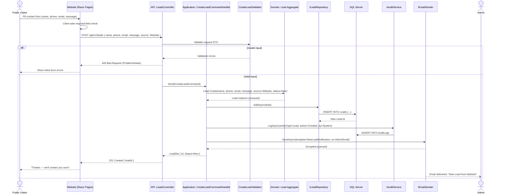
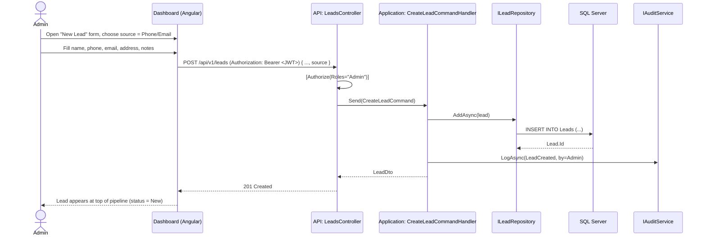
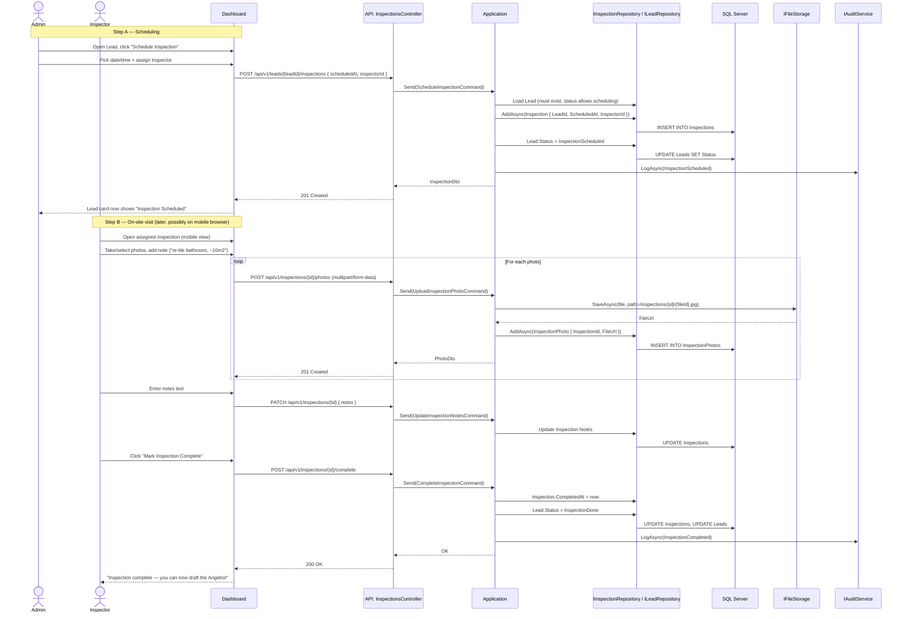
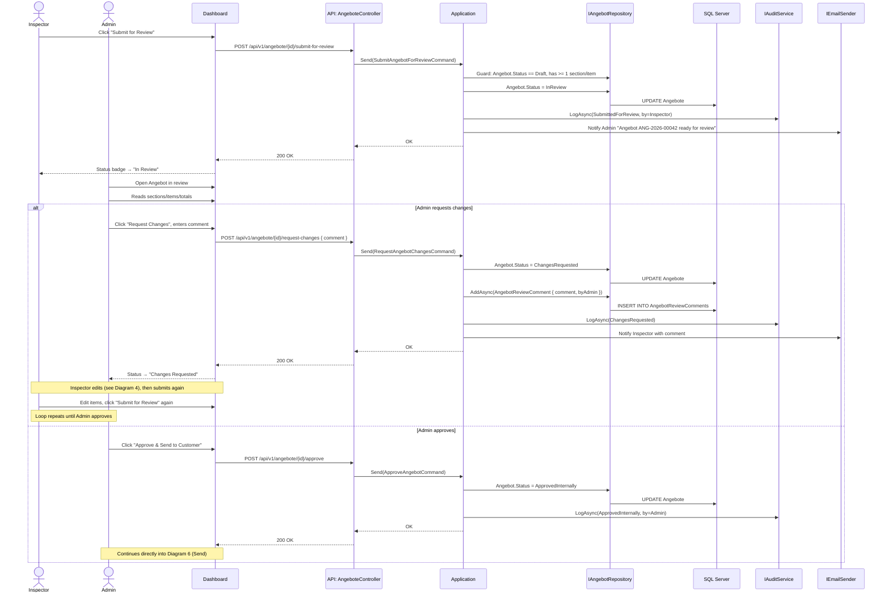
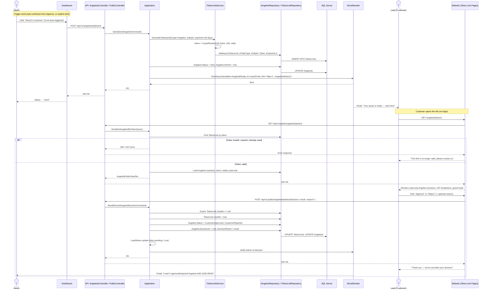
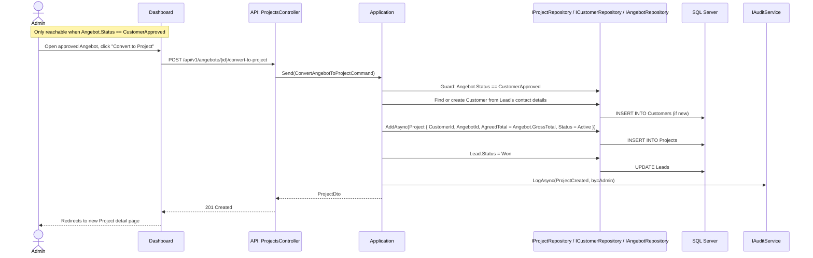
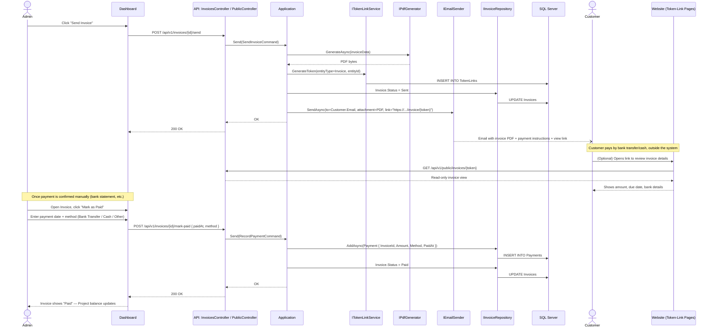
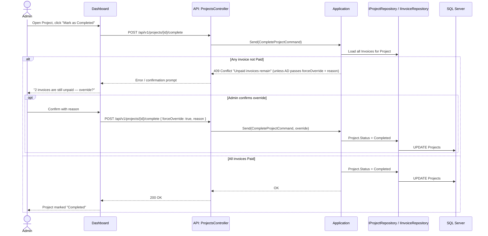
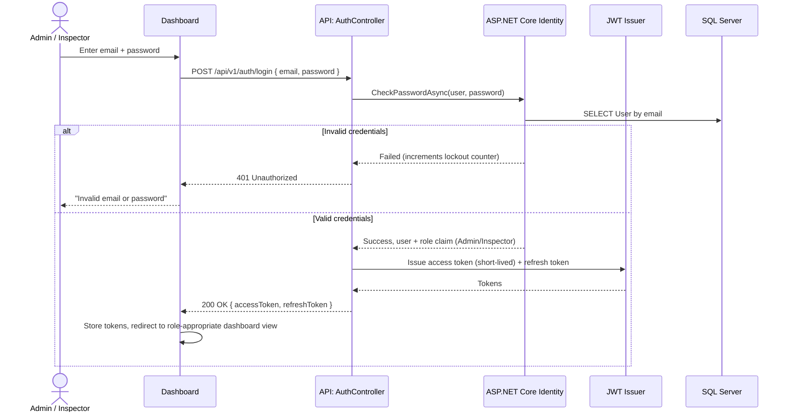
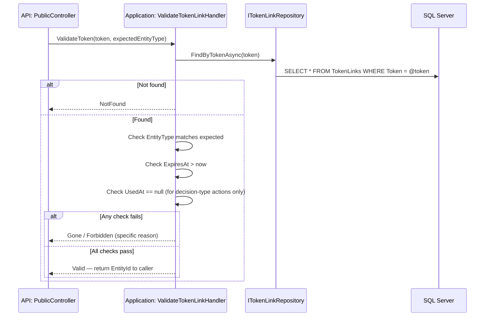

# Sequence Diagrams

**Project:** RenoTrack — Renovation Company Website & Project-Tracking Dashboard
**Companion documents:** SRS.md, Architecture.md, StateMachine.md

This document details, flow by flow, exactly what happens between the Client (Browser), the API, the Application layer (Command/Query handlers), the Domain, the Database, and external services (Email). Each diagram maps back to its SRS requirement IDs.

---

## 1. Lead Creation — Website Contact Form
**Covers:** FR-1.3, FR-9.2



---

## 2. Lead Creation — Manual (Phone / Email)
**Covers:** FR-2.1



---

## 3. Scheduling & Completing an Inspection
**Covers:** FR-2.3, FR-3.1–FR-3.4



---

## 4. Building the Angebot (Draft, Sections, Items, Live Totals)
**Covers:** FR-4.1–FR-4.7

```mermaid
sequenceDiagram
    actor INS as Inspector
    participant DASH as Dashboard
    participant API as API: AngeboteController
    participant APP as Application
    participant NUM as INumberGeneratorService
    participant DOM as Domain: Angebot Aggregate
    participant REPO as IAngebotRepository
    participant DB as SQL Server

    Note over INS,DASH: Create the draft
    INS->>DASH: Click "Create Angebot" on Lead (status = InspectionDone)
    DASH->>API: POST /api/v1/leads/{leadId}/angebote { inspectionId? }
    API->>APP: Send(CreateAngebotCommand)
    APP->>REPO: Guard: Lead.Status == InspectionDone
    APP->>NUM: NextAngebotNumber(year)
    NUM->>DB: UPDATE NumberSequences (atomic increment)
    NUM-->>APP: "ANG-2026-00042"
    APP->>DOM: Angebot.CreateDraft(leadId, inspectionId, number)
    APP->>REPO: AddAsync(angebot)
    REPO->>DB: INSERT INTO Angebote
    APP-->>API: AngebotDto { Id, Status=Draft }
    API-->>DASH: 201 Created
    DASH-->>INS: Empty Angebot editor opens

    Note over INS,DASH: Add a Section
    INS->>DASH: Click "Add Section" → "Pos. 3 Vorarbeiten Kellerböden"
    DASH->>API: POST /api/v1/angebote/{id}/sections { title, sortOrder }
    API->>APP: Send(AddAngebotSectionCommand)
    APP->>REPO: GetByIdWithDetailsAsync(angebotId)
    APP->>DOM: angebot.AddSection(title, sortOrder)
    REPO->>DB: INSERT INTO AngebotSections
    APP-->>API: SectionDto
    API-->>DASH: 201 Created

    Note over INS,DASH: Add a Line Item (repeats per item)
    INS->>DASH: Fill item form: description, qty=13.77, unit=m2, unitPrice=18.56, vatRate=19
    DASH->>API: POST /api/v1/angebote/{id}/sections/{sectionId}/items { ... }
    API->>APP: Send(AddAngebotItemCommand)
    APP->>DOM: section.AddItem(description, qty, unit, unitPrice, vatRate)
    DOM->>DOM: item.LineTotal = qty * unitPrice
    DOM->>DOM: section.Subtotal = sum(items.LineTotal)
    DOM->>DOM: angebot.RecalculateTotals()
    Note right of DOM: NetTotal, VAT-by-rate breakdown,<br/>GrossTotal all recomputed here (Architecture §6.1)
    APP->>REPO: SaveChangesAsync (via IUnitOfWork)
    REPO->>DB: INSERT INTO AngebotItems; UPDATE AngebotSections; UPDATE Angebote (cached totals)
    APP-->>API: ItemDto + updated AngebotSummaryDto
    API-->>DASH: 201 Created { item, summary }
    DASH-->>INS: Row appears; section subtotal and grand total update live

    Note over INS,DASH: Add a Line Item FROM the Catalog (faster path — SRS FR-4.8/4.9)
    INS->>DASH: Open Catalog picker, search/select "Bodenbelag trockengepresste Fliesen/Platten…"
    DASH->>API: GET /api/v1/catalog-items?search=...
    API->>APP: Send(SearchCatalogItemsQuery)
    APP-->>API: List of matching CatalogItem
    API-->>DASH: 200 OK
    DASH-->>INS: Form pre-filled with description, specification, unit; Inspector only enters qty + confirms price
    DASH->>API: POST /api/v1/angebote/{id}/sections/{sectionId}/items { catalogItemId, qty, unitPrice, vatRate }
    API->>APP: Send(AddAngebotItemCommand)
    Note right of APP: Same recalculation logic as the custom-item path above
    APP->>DOM: section.AddItem(..., catalogItemId)
    REPO->>DB: INSERT INTO AngebotItems (CatalogItemId set, own copy of description/spec/price — BR-8)
    APP-->>API: ItemDto + updated summary
    API-->>DASH: 201 Created

    Note over INS,DASH: Save a custom item back to the Catalog (grows the Catalog organically — FR-4.10)
    INS->>DASH: After typing a custom item, click "Save as Catalog item"
    DASH->>API: POST /api/v1/angebot-items/{itemId}/save-as-catalog-item
    API->>APP: Send(SaveAngebotItemAsCatalogItemCommand)
    APP->>REPO: AddAsync(CatalogItem { Title, DefaultSpecification, DefaultUnit, SuggestedUnitPrice, CreatedFromAngebotItemId })
    REPO->>DB: INSERT INTO CatalogItems
    APP-->>API: CatalogItemDto
    API-->>DASH: 201 Created
    DASH-->>INS: "Saved — available for future Angebote"

    Note over INS,DASH: Save as Draft (at any point)
    INS->>DASH: Navigate away / click "Save Draft"
    DASH->>API: (No extra call needed — every add/edit above is already persisted)
    DASH-->>INS: "Draft saved automatically"
```

---

## 5. Internal Review Loop (Submit → Review → Approve / Changes Requested)
**Covers:** FR-5.1–FR-5.4



---

## 6. Sending the Angebot & Customer Decision (Token Link)
**Covers:** FR-6.1–FR-6.6



---

## 7. Converting an Approved Angebot into a Project
**Covers:** FR-7.1



---

## 8. Creating & Splitting Invoices
**Covers:** FR-8.1, FR-8.2

```mermaid
sequenceDiagram
    actor AD as Admin
    participant DASH as Dashboard
    participant API as API: InvoicesController
    participant APP as Application
    participant NUM as INumberGeneratorService
    participant REPO as IInvoiceRepository / IProjectRepository
    participant DB as SQL Server

    AD->>DASH: Open Project, click "Add Invoice"
    DASH->>API: GET /api/v1/projects/{id}/invoice-balance
    API->>APP: Send(GetRemainingInvoiceBalanceQuery)
    APP->>REPO: remaining = Project.AgreedTotal - SUM(existing Invoices.GrossAmount)
    APP-->>API: { agreedTotal, alreadyInvoiced, remaining }
    API-->>DASH: 200 OK
    DASH-->>AD: Shows "€25,673.36 agreed / €0 invoiced / €25,673.36 remaining"

    AD->>DASH: Enter first invoice: amount = €8,000 (e.g. project start)
    DASH->>API: POST /api/v1/projects/{id}/invoices { grossAmount, dueDate }
    API->>APP: Send(CreateInvoiceCommand)
    APP->>NUM: NextInvoiceNumber(year)
    NUM->>DB: UPDATE NumberSequences (atomic)
    NUM-->>APP: "RE-2026-00017"
    APP->>APP: Derive Net/VAT split proportionally from the Angebot's VAT-rate mix (Architecture §6.1)
    APP->>REPO: AddAsync(Invoice { ProjectId, Number, NetAmount, VatAmount, GrossAmount, Status=Draft })
    REPO->>DB: INSERT INTO Invoices
    APP-->>API: InvoiceDto
    API-->>DASH: 201 Created
    DASH-->>AD: Invoice appears under Project; remaining balance updates
    Note over AD,DASH: Repeats for each additional invoice (BR-3: warn if sum != AgreedTotal)
```

---

## 9. Sending an Invoice & Recording Payment
**Covers:** FR-8.3, FR-8.4



---

## 10. Project Completion
**Covers:** FR-7.3, FR-8.6



---

## 11. Admin / Inspector Authentication
**Covers:** FR-10.1–FR-10.3



---

## 12. Token Validation Detail (Cross-cutting)
**Covers:** Architecture §7.2 (referenced by Diagrams 6 and 9)


