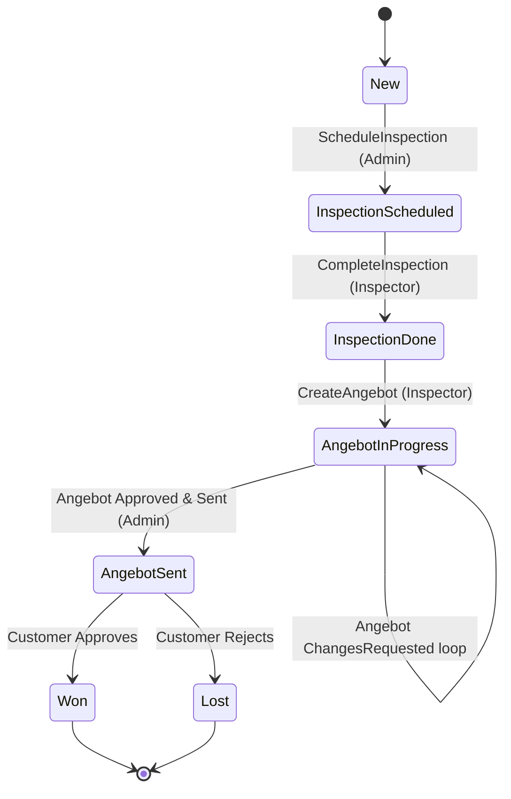
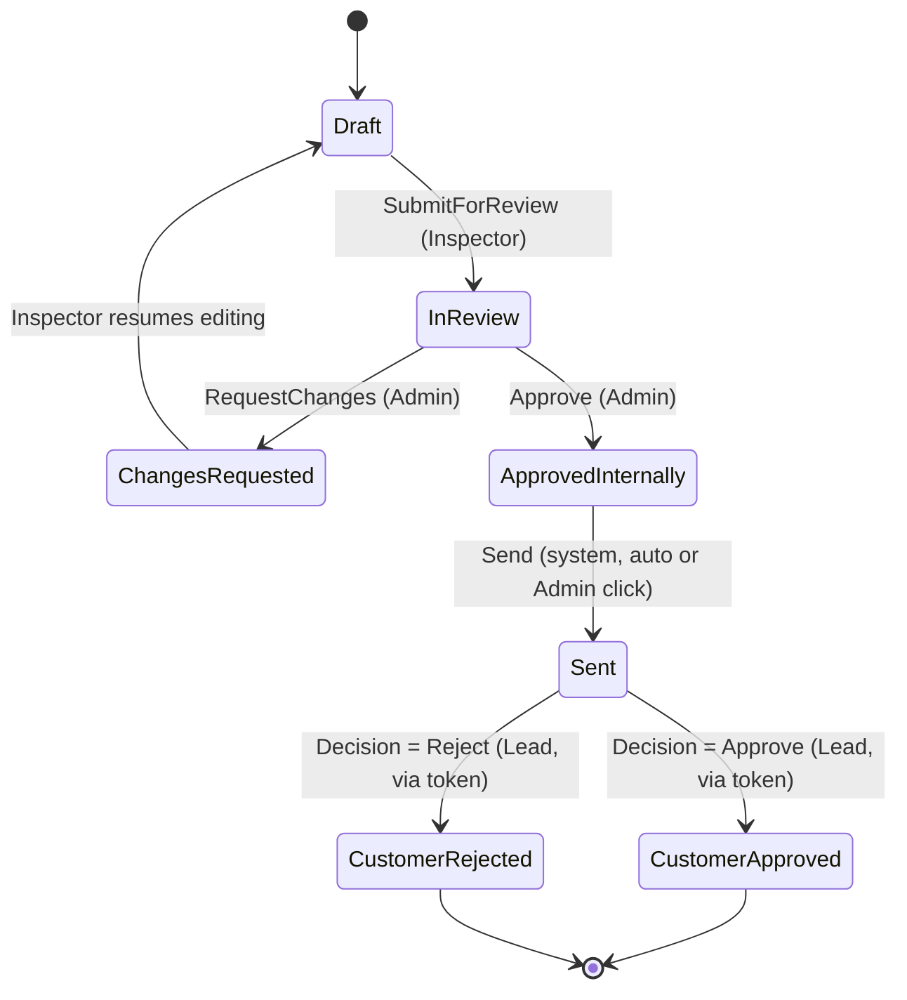
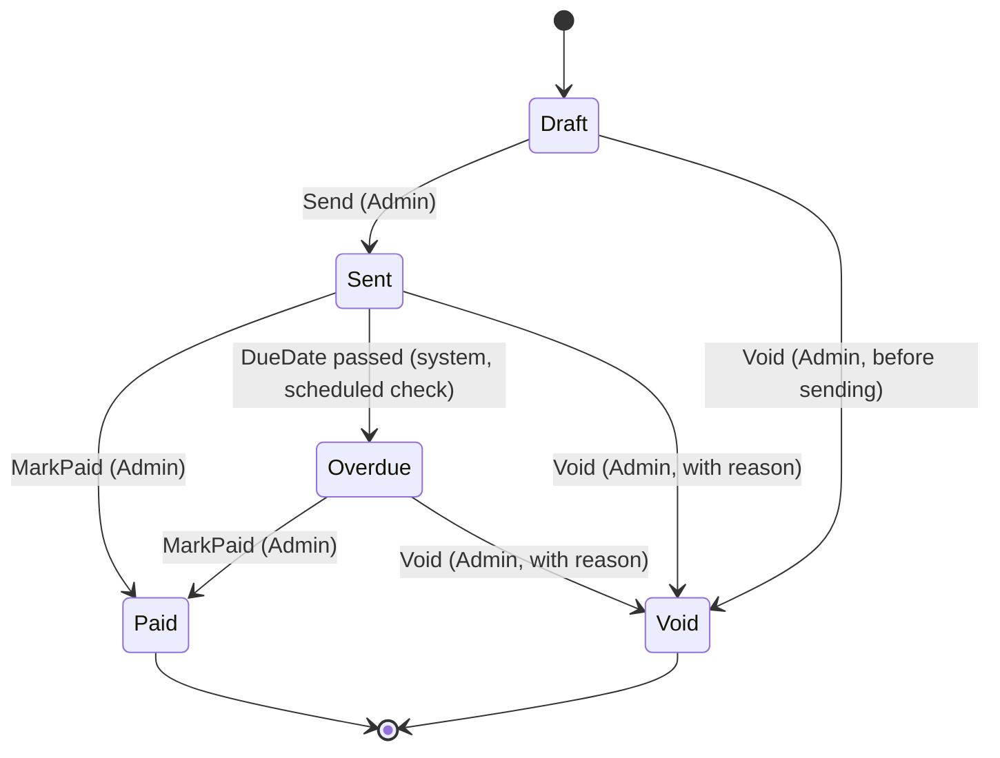
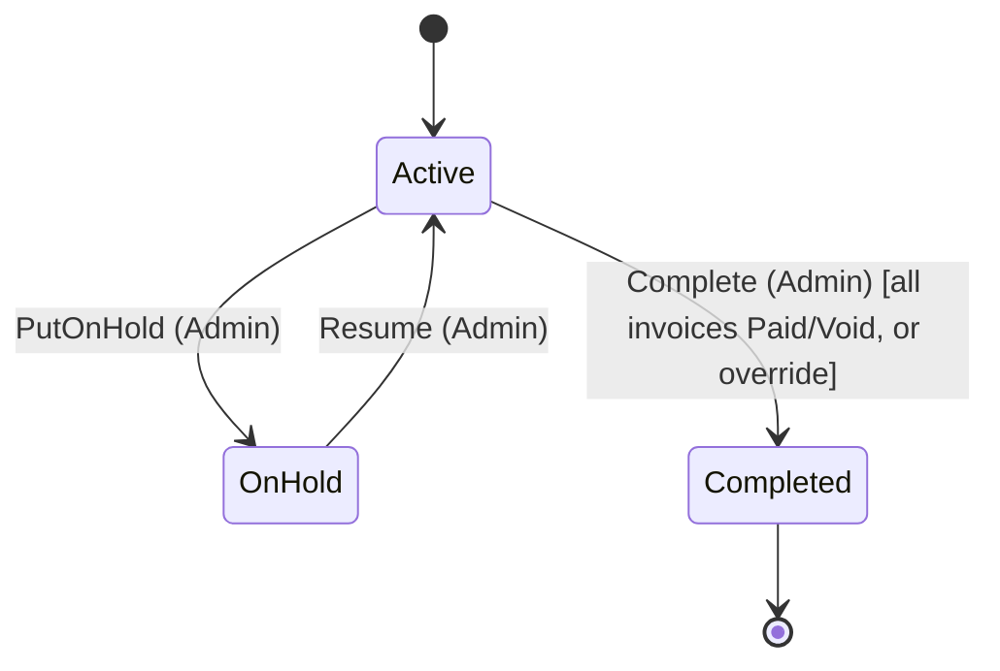

# State Machine Specification

**Project:** RenoTrack — Renovation Company Website & Project-Tracking Dashboard
**Companion documents:** SRS.md, Architecture.md, Sequence Diagram.md

This document formally defines every state, transition, guard condition, and side effect for the four stateful entities in the system: **Lead**, **Angebot**, **Invoice**, and **Project**. Business Rule BR-7 (no silent/implicit transitions) is enforced by making every transition below explicit and triggered by a named command.

---

## 1. Lead State Machine

### 1.1 States

| State | Meaning |
|---|---|
| `New` | Just created, not yet acted on |
| `InspectionScheduled` | An on-site Inspection has been booked |
| `InspectionDone` | Inspector has completed the visit; Angebot can now be drafted |
| `AngebotInProgress` | An Angebot exists and is being drafted/reviewed internally (mirrors the Angebot's internal states) |
| `AngebotSent` | The Angebot has been sent to the Lead and awaits their decision |
| `Won` | The Lead approved the Angebot and it became a Project |
| `Lost` | The Lead rejected the Angebot (terminal) |

### 1.2 Diagram

### 1.3 Transition Table

| From | Event | Guard | To | Side Effects |
|---|---|---|---|---|
| `New` | `ScheduleInspection` | Lead exists | `InspectionScheduled` | Inspection record created; Lead.AssignedInspectorId set to the scheduled Inspector (BR-13); AuditLog entry |
| `InspectionScheduled` | `CompleteInspection` | Inspection belongs to this Lead | `InspectionDone` | Inspection.CompletedAt set; AuditLog entry |
| `InspectionDone` | `CreateAngebot` | Lead has no open (non-rejected) Angebot already | `AngebotInProgress` | New Angebot in `Draft` state created |
| `AngebotInProgress` | (internal Angebot events) | — | `AngebotInProgress` (no Lead-level change) | See Angebot state machine §2 |
| `AngebotInProgress` | Angebot reaches `Sent` | Angebot.Status == Sent | `AngebotSent` | Token link emailed to Lead |
| `AngebotSent` | Angebot decision == Approved | TokenLink valid & unused | `Won` | Triggers eligibility for `ConvertAngebotToProject` |
| `AngebotSent` | Angebot decision == Rejected | TokenLink valid & unused | `Lost` | Terminal — no further action expected on this Lead |

### 1.4 Notes
- `Won` and `Lost` are terminal for the Lead entity itself. A rejected Lead is not automatically deleted or hidden — it remains visible in the pipeline for historical/reporting purposes (Future Enhancement §9 in SRS covers reporting).
- Per SRS OQ-4 (open question), if "revise and resend" after rejection is approved later, `Lost` would need an additional outbound transition back to `AngebotInProgress` — deliberately not modeled yet since it's still an open decision.

---

## 2. Angebot State Machine

### 2.1 States

| State | Meaning |
|---|---|
| `Draft` | Inspector is actively building the Angebot |
| `InReview` | Submitted to Admin, awaiting internal decision |
| `ChangesRequested` | Admin sent it back with comments |
| `ApprovedInternally` | Admin approved; about to be / already being sent |
| `Sent` | Token link emailed to the Lead; awaiting customer decision |
| `CustomerApproved` | Lead approved via token link (terminal — success) |
| `CustomerRejected` | Lead rejected via token link (terminal — closed) |

### 2.2 Diagram

### 2.3 Transition Table

| From | Event | Guard | To | Side Effects |
|---|---|---|---|---|
| `Draft` | `SubmitForReview` | At least 1 section with at least 1 item | `InReview` | Notify Admin |
| `InReview` | `RequestChanges` | — | `ChangesRequested` | ReviewComment saved; notify Inspector |
| `InReview` | `Approve` | — | `ApprovedInternally` | AuditLog entry |
| `ChangesRequested` | (Inspector edits items — no explicit state event) | — | `Draft` | Angebot moves back to Draft the moment editing resumes, so it must be resubmitted |
| `ApprovedInternally` | `Send` | Lead has a valid email address | `Sent` | TokenLink generated; email sent; `SentAt` timestamp set |
| `Sent` | `RecordDecision(Approve)` | TokenLink valid, unused, not expired | `CustomerApproved` | `DecisionAt`/`DecisionResult` set; Lead → `Won`; notify Admin |
| `Sent` | `RecordDecision(Reject)` | TokenLink valid, unused, not expired | `CustomerRejected` | `DecisionAt`/`DecisionResult` set; Lead → `Lost`; notify Admin |

### 2.4 Invariants
- An Angebot's totals (NetTotal, VAT breakdown, GrossTotal) may only be recalculated while `Status == Draft` or `ChangesRequested`. Once `InReview` or later, the Angebot is effectively locked from further line-item edits — the only way back to an editable state is via `RequestChanges`, which explicitly returns it to `Draft`.
- Only one Angebot per Lead may be in a non-terminal state (`Draft`/`InReview`/`ChangesRequested`/`ApprovedInternally`/`Sent`) at a time.

---

## 3. Invoice State Machine

### 3.1 States

| State | Meaning |
|---|---|
| `Draft` | Created by Admin, not yet sent |
| `Sent` | Emailed/delivered to the customer with payment instructions |
| `Paid` | Payment manually confirmed by Admin |
| `Overdue` | Past its due date and still not paid (derived/scheduled state, not user-triggered) |
| `Void` | Cancelled — never deleted, to preserve the numbering sequence (BR-9) |

### 3.2 Diagram

### 3.3 Transition Table

| From | Event | Guard | To | Side Effects |
|---|---|---|---|---|
| `Draft` | `Send` | Invoice has a valid GrossAmount > 0 | `Sent` | PDF generated; TokenLink created; email sent |
| `Draft` | `Void` | Admin provides a reason | `Void` | Invoice number is retained (not reused) |
| `Sent` | `MarkPaid` | — | `Paid` | Payment record created; Project balance recalculated |
| `Sent` | *(scheduled check)* | `DueDate < today` and not yet Paid | `Overdue` | No customer-facing email required for v1 (dashboard flag only) |
| `Overdue` | `MarkPaid` | — | `Paid` | Same as above |
| `Sent` / `Overdue` | `Void` | Admin provides a reason | `Void` | AuditLog entry with reason; invoice excluded from "remaining balance" math going forward |

### 3.4 Invariants
- Invoice numbers are never reused, even for `Void` invoices (**BR-9**). *(Corrected in Phase 8 Slice 1: §3.1 and this line both cited **BR-5**, which is the mandatory §14 UStG field list. Non-reuse of invoice numbers is BR-9. `BusinessRules.md` itself was correct throughout; only these two citations were wrong.)*
- **A reason is required for every void, from every source state**, including `Draft`. `PermissionMatrix.md` §5 states this without qualification ("Admin-only, requires a reason"); §3.3's `Draft → Void` row previously left its guard cell blank while the `Sent`/`Overdue` row said "Admin provides a reason". *(Reconciled in Phase 8 Slice 1: treated as an omission in this table rather than an exemption, and enforced by `Invoice.Void(reason)` in the Domain.)*
- A Project cannot move to `Completed` while any of its Invoices are in `Draft`, `Sent` or `Overdue`, nor while it has no Invoices at all (see Project state machine §4.3 and §4.4), unless the Admin explicitly overrides with a reason (FR-8.6). *(Corrected in Phase 8 Slice 6: this line previously named only `Sent` and `Overdue`, which contradicted §4.3's own guard over a `Draft` Invoice. §4.4 records the full reconciliation, including Sequence Diagram §10's third, separate wording.)*

---

## 4. Project State Machine

### 4.1 States

| State | Meaning |
|---|---|
| `Active` | Work is underway / Project has been created |
| `OnHold` | Temporarily paused (e.g. waiting on materials or customer) |
| `Completed` | All work finished and (normally) all invoices paid |

### 4.2 Diagram

### 4.3 Transition Table

| From | Event | Guard | To | Side Effects |
|---|---|---|---|---|
| `[*]` | `ConvertAngebotToProject` | Angebot.Status == `CustomerApproved` | `Active` | Customer created/linked; Project created with AgreedTotal |
| `Active` | `PutOnHold` | — | `OnHold` | Reason optional/free text |
| `OnHold` | `Resume` | — | `Active` | — |
| `Active` | `Complete` | The Project has **at least one** Invoice **and** every one of them is `Paid` or `Void` | `Completed` | `CompletedAt` set; AuditLog entry (`ProjectCompleted`, no details); Lead already `Won`, no further change needed there |
| `Active` | `Complete` (override) | Admin supplies `forceOverride=true` + a non-blank reason, **and a blocking condition actually exists** | `Completed` | `CompletedAt` set; AuditLog entry explicitly records the override and reason |

### 4.4 Completion guard — reconciliation and clarifications

*Recorded in Phase 8 Slice 6, when `CompleteProjectCommand` was built. Two of these correct this
document; none of them changes a decision made elsewhere.*

- **Which Invoice statuses block completion was contradicted three ways, and is now settled as
  §4.3's row above.** This table's guard read "All Invoices.Status == `Paid` (or `Void`)", which
  blocks a `Draft`; **§3.4's invariant** read "while any of its Invoices are in `Sent` or
  `Overdue`", which does not; and **Sequence Diagram §10's** `alt Any invoice not Paid` would have
  blocked on a `Void`, contradicting both. **Resolved in favour of §4.3:** `Draft`, `Sent` and
  `Overdue` all block; `Paid` and `Void` do not. §3.4 has been corrected to match and Sequence
  Diagram §10 carries a correction note. The choice was put to the Product Owner explicitly rather
  than reconciled silently — a `Draft` Invoice is money the company still intends to collect, and
  a Project closed over one is a bill nobody will chase.
- **A Project with no Invoices at all is blocked, and this is a new rule rather than a reading of an
  old one.** "All Invoices are `Paid` or `Void`" is vacuously true over an empty set, so the guard
  as previously worded would have let a Project that was never invoiced close silently, while SRS
  FR-7.3 ("once its final invoice has been paid") presupposes one exists. Such a Project is
  completable only through the FR-8.6 override, with a reason.
- **The override reaches the invoice precondition and nothing else.** No value of `forceOverride`
  completes a Project that is not `Active`: §4.2 draws no `OnHold → Completed` edge, and that guard
  lives inside the `Project` aggregate where no request field can reach it. **Note the reporting
  order:** the invoice precondition is evaluated before the transition is attempted, so a
  non-`Active` Project with blocking Invoices reports the invoice refusal, and one with settled
  Invoices plus an override reports the "nothing to override" 400 below. Both still refuse, and no
  input completes a non-`Active` Project — only the message differs. That ordering is deliberate:
  it keeps the aggregate untouched on every refusal path (`ARCHITECTURE_DECISIONS.md` D67).
- **`forceOverride` supplied when nothing is blocking is refused (400).** An override must override
  something, and no AuditLog entry is written for the refused attempt — a recorded override reason
  against a Project that had nothing to override would be a false justification in the permanent
  record.
- **The override reason has no column of its own.** `ERD.md`'s `PROJECT` defines none and none was
  added, so the AuditLog entry is its only home — which inherits D50's best-effort semantics.
  Recorded as a known limitation in `NEXT_STEPS.md`, deliberately not solved by inventing schema.

---

## 5. Cross-Entity State Consistency

| Rule | Enforced By |
|---|---|
| A Lead cannot reach `Won` unless its Angebot reached `CustomerApproved` | Lead.Status is only set to `Won` inside the same transaction as the Angebot decision handler (Sequence Diagram §6) |
| A Project cannot be created from a non-`CustomerApproved` Angebot | Guard clause in `ConvertAngebotToProjectCommand` (Sequence Diagram §7) |
| An Invoice cannot exist without a `Active`/`OnHold` Project | Foreign key + guard clause in `CreateInvoiceCommand` |
| A Project cannot silently become `Completed` with unpaid Invoices | Guard clause in `CompleteProjectCommand`, explicit override path only (FR-8.6) |
